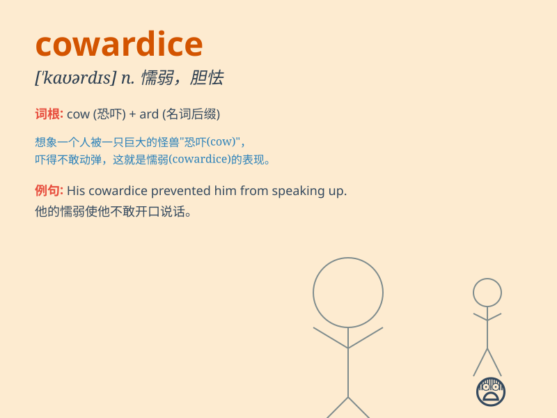

## cowardice

**英音:** _[\'kaʊədɪs]_ **美音:** _[\'kaʊɚdɪs]_

**译义:** *n.怯懦,胆小*

### 短语

+ **act of cowardice:** _怯懦的行为_

+ **show cowardice:** _表现出怯懦_

+ **cowardice in the face of danger:** _面对危险时的怯懦_

+ **overcome cowardice:** _克服怯懦_

+ **display cowardice:** _展示怯懦_

### 例句

#### 例句1

> **His cowardice prevented him from standing up for his beliefs.**

**中文翻译:** 他的怯懦使他无法坚持自己的信仰。

**单词释义:** 懦弱；胆小

#### 例句2

> **She despised his cowardice in the face of danger.**

**中文翻译:** 她鄙视他在危险面前的怯懦。

**单词释义:** 怯懦；胆小怕事

#### 例句3

> **Cowardice led to his failure in the crucial moment.**

**中文翻译:** 怯懦导致了他在关键时刻的失败。

**单词释义:** 胆怯；懦弱

### 背诵小故事

> A young soldier was always afraid to face battles. His comrades
called him a coward. This behavior of always being scared and avoiding
danger was called cowardice. Eventually, he overcame it and became
brave.

**一个年轻的士兵总是害怕面对战斗。他的战友称他为胆小鬼。这种总是感到害怕并逃避危险的行为被称为怯懦。最终，他克服了它，变得勇敢。**

### 图义

