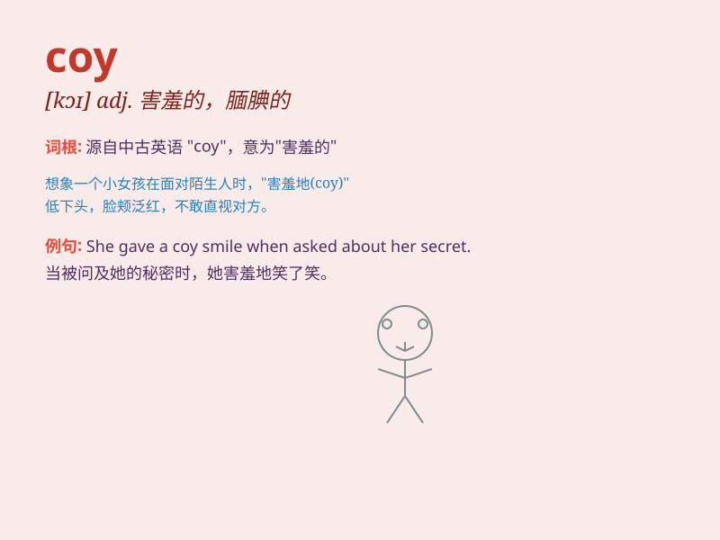

## coy

**英音:** _[kɒɪ]_ **美音:** _[kɔɪ]_

**译义:** *adj.腼腆的,怕羞的,卖弄风情的*

### 短语

+ **be coy about:** _对\...\...含糊其辞；对\...\...不愿多谈_

+ **coy smile:** _害羞的微笑_

+ **coy look:** _羞涩的表情_

+ **play coy:** _装害羞；故作忸怩_

+ **coy modesty:** _故作谦逊_

### 例句

#### 例句1

> **She gave a coy smile when he complimented her.**

**中文翻译:** 当他称赞她时，她露出腼腆的微笑。

**单词释义:** 害羞的

#### 例句2

> **He was being coy about his plans for the weekend.**

**中文翻译:** 他对周末的计划含糊其辞。

**单词释义:** 遮遮掩掩的

#### 例句3

> **The actress was coy in answering questions about her personal
life.**

**中文翻译:** 这位女演员在回答有关她个人生活的问题时很害羞。

**单词释义:** 忸怩作态的

### 背诵小故事

> A little rabbit was always coy when meeting strangers. It would hide
behind the bushes and peek out shyly. But as it got familiar, it became
more friendly. \'Coy\' means being shy or pretending to be shy.

**一只小兔子见到陌生人总是很害羞。它会躲在灌木丛后面，害羞地偷看。但熟悉之后，它就变得更友好了。\'coy\'意思是害羞的或装作害羞的。**

### 图义

