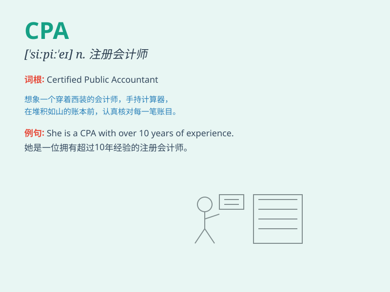

## CPA

**英音:** _[siː piː ˈeɪ]_ **美音:** _[siː piː ˈeɪ]_

**译义:** *CPA是Certified Public
Accountant的缩写，中文意思是注册会计师。注册会计师是指通过国家或地区的会计师资格考试，取得注册会计师资格证书的专业人士。他们通常在会计、审计、税务等领域提供专业服务。*

### 短语

+ **CPA exam:** _注册会计师考试_

+ **CPA certificate:** _注册会计师证书_

+ **CPA firm:** _注册会计师事务所_

+ **CPA candidate:** _注册会计师考生_

+ **CPA professional:** _注册会计师专业人士_

### 例句

#### 例句1

> **He decided to become a CPA to pursue a career in accounting.**

**中文翻译:** 他决定成为一名注册会计师，以从事会计职业。

**单词释义:** 注册会计师

#### 例句2

> **The company hired a CPA to handle their financial audits.**

**中文翻译:** 这家公司聘请了一位注册会计师来处理他们的财务审计。

**单词释义:** 注册会计师

#### 例句3

> **She passed the CPA exam and was very excited.**

**中文翻译:** 她通过了注册会计师考试，非常兴奋。

**单词释义:** 注册会计师

### 背诵小故事

> 想象一下，有个超级聪明的会计师，大家都叫他 CPA
先生。他总能精准算出复杂的账目，帮助企业节省很多钱。因为他，CPA
这个称号变得令人敬仰。

**想象有个叫 CPA 先生的聪明会计师，能精准算账目并帮企业省钱，使 CPA
称号令人敬仰。**

### 图义

