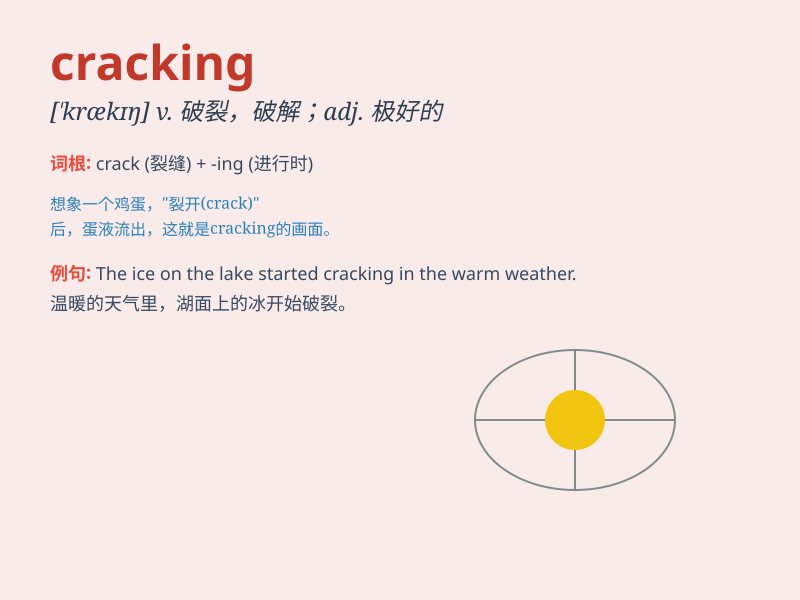

## cracking

**英音:** _[\'krækɪŋ]_ **美音:** _[\'krækɪŋ]_

**译义:** *n.破裂,裂化*

### 短语

+ **cracking down:** _严厉打击；镇压_

+ **cracking up:** _（因精神压力）崩溃；大笑_

+ **cracking the code:** _破解密码；解开谜团_

+ **cracking good:** _非常好的；出色的_

+ **cracking pace:** _飞快的速度_

### 例句

#### 例句1

> **The cracking sound of the firecrackers scared the dog.**

**中文翻译:** 爆竹的爆竹声吓坏了狗。

**单词释义:** 爆裂(声)

#### 例句2

> **She has a cracking sense of humor.**

**中文翻译:** 她很有幽默感。

**单词释义:** 极好的；出色的

#### 例句3

> **The ice on the lake is starting to crack.**

**中文翻译:** 湖面上的冰开始破裂。

**单词释义:** 破裂；裂开

### 背诵小故事

> One day, a little boy was trying to crack open a walnut. He used all
his strength and finally heard a cracking sound. The walnut shell broke,
and he was very happy.

**一天，一个小男孩试图敲开一个核桃。他用尽全身力气，终于听到了一声破裂声。核桃壳裂开了，他非常高兴。**

### 图义

