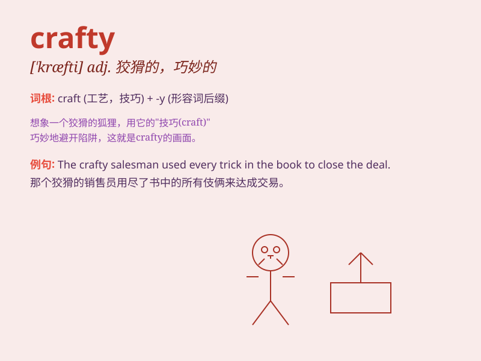

## crafty

**英音:** _[\'krɑːftɪ]_ **美音:** _[\'kræfti]_

**译义:** *adj.狡诈的,诡计多端的,善于骗人的*

### 短语

+ **crafty scheme:** _狡猾的计划_

+ **crafty trick:** _狡诈的诡计_

+ **crafty fox:** _狡猾的狐狸_

+ **crafty mind:** _狡诈的心思_

+ **crafty politician:** _狡猾的政客_

### 例句

#### 例句1

> **The crafty fox managed to escape from the trap.**

**中文翻译:** 狡猾的狐狸设法逃脱了陷阱。

**单词释义:** 狡猾的

#### 例句2

> **He is a crafty businessman who always finds ways to make more
profit.**

**中文翻译:** 他是一个狡猾的商人，总是想方设法赚取更多利润。

**单词释义:** 狡猾的

#### 例句3

> **The crafty thief stole the jewels without being noticed.**

**中文翻译:** 狡猾的小偷在不被发现的情况下偷走了珠宝。

**单词释义:** 狡猾的

### 背诵小故事

> A fox was always looking for food in the forest. It was very crafty.
It knew how to hide and wait for the best moment to catch its prey. This
fox was a master of crafty tricks.

**一只狐狸总是在森林里寻找食物。它非常狡猾。它知道如何隐藏并等待最佳时机捕捉猎物。这只狐狸是狡猾诡计的大师。**

### 图义

