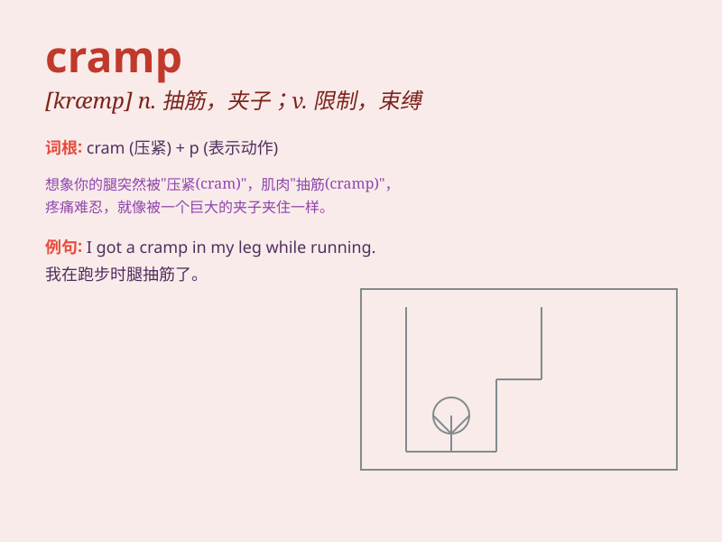

## cramp

**英音:** _[kræmp]_ **美音:** _[kræmp]_

**译义:**
*n.抽筋,腹部绞痛,(pl.)月经痛adj.狭窄的,难解的vt.使抽筋,以铁箍扣紧*

### 短语

+ **muscle cramp:** _肌肉痉挛_

+ **cramp someone\'s style:** _束缚某人的风格；妨碍某人_

+ **writing cramp:** _书写痉挛_

+ **cramp in the leg:** _腿部抽筋_

+ **cramp iron:** _钢筋；铁夹钳_

### 例句

#### 例句1

> **The cramp in my leg made it difficult to walk.**

**中文翻译:** 我的腿抽筋，走路很困难。

**单词释义:** 抽筋；痉挛

#### 例句2

> **The small room cramps our style of living.**

**中文翻译:** 小房间限制了我们的生活方式。

**单词释义:** 限制；束缚

#### 例句3

> **The athlete was sidelined due to a cramp in his calf muscle.**

**中文翻译:** 该运动员因小腿肌肉抽筋而缺席比赛。

**单词释义:** 抽筋；痉挛

### 背诵小故事

> A climber was halfway up the mountain when suddenly he got cramp in
his leg. The pain was so intense that he had to stop and rest. Remember,
\'cramp\' means a sudden painful contraction of a muscle.

**一位登山者爬到半山腰时，突然腿部抽筋。疼痛非常剧烈，他不得不停下来休息。记住，\'cramp\'意思是肌肉的突然疼痛性收缩。**

### 图义

