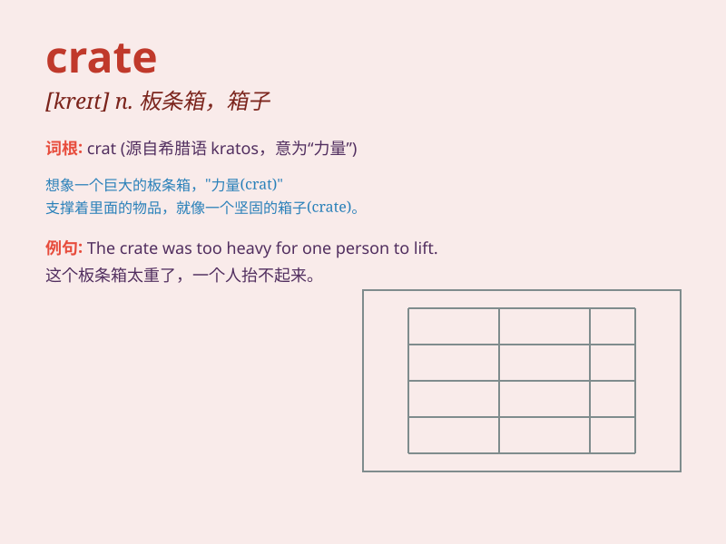

## crate

**英音:** _[kreɪt]_ **美音:** _[kret]_

**译义:** *n.板条箱,柳条箱*

### 短语

+ **wooden crate:** _木箱_

+ **metal crate:** _金属箱_

+ **crate of apples:** _一箱苹果_

+ **storage crate:** _储物箱_

+ **shipping crate:** _运输箱_

### 例句

#### 例句1

> **The workers loaded the crates onto the truck.**

**中文翻译:** 工人们将板条箱装上卡车。

**单词释义:** 板条箱；柳条箱

#### 例句2

> **He found a puppy hiding in a crate in the corner.**

**中文翻译:** 他发现一只小狗躲在角落里的板条箱里。

**单词释义:** 板条箱；柳条箱

#### 例句3

> **The fruit was packed in wooden crates for shipping.**

**中文翻译:** 水果被装在木箱中以便运输。

**单词释义:** 木箱

### 背诵小故事

> One day, a little boy saw a big crate on the street. He wondered what
was inside. When he opened it, he found many toys. He was so happy and
shouted, \'This crate is like a treasure box!\'

**有一天，一个小男孩在街上看到一个大箱子。他好奇里面有什么。当他打开时，发现了许多玩具。他非常高兴并喊道：'这个板条箱就像一个百宝箱！'**

### 图义

