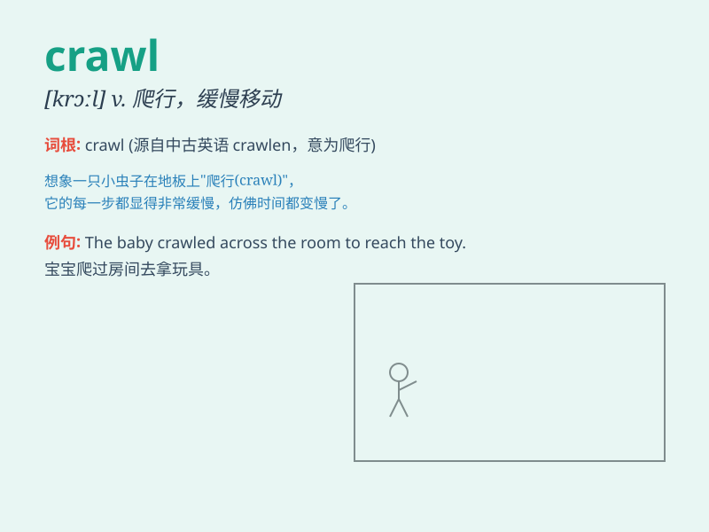

## crawl

**英音:** _[krɔːl]_ **美音:** _[krɔl]_

**译义:** *vi.爬行,蠕动,徐徐行进n.爬行,蠕动,缓慢的行进*

### 短语

+ **crawl space:** _（建筑物底层地板下供检修管道等用的）狭小空间_

+ **crawl out:** _爬出来_

+ **crawl up:** _爬上_

+ **crawl into:** _爬进_

+ **crawl along:** _沿着......爬行_

### 例句

#### 例句1

> **The baby crawled across the floor.**

**中文翻译:** 婴儿在地板上爬行。

**单词释义:** 爬行

#### 例句2

> **The traffic was crawling along the road.**

**中文翻译:** 道路上车流缓慢。

**单词释义:** 缓慢行进

#### 例句3

> **The spider crawled up the wall.**

**中文翻译:** 蜘蛛爬上了墙。

**单词释义:** 爬

### 背诵小故事

>
想象一只小毛毛虫努力在树叶上爬行。它的小脚慢慢地移动，身体一点点向前，这就是\'crawl\'。小毛毛虫艰难地\'crawl\'，想要找到一片更鲜嫩的叶子。

**想象一只小毛毛虫努力在树叶上爬行。它的小脚慢慢地移动，身体一点点向前，这就是"爬行"。小毛毛虫艰难地"爬行"，想要找到一片更鲜嫩的叶子。**

### 图义

