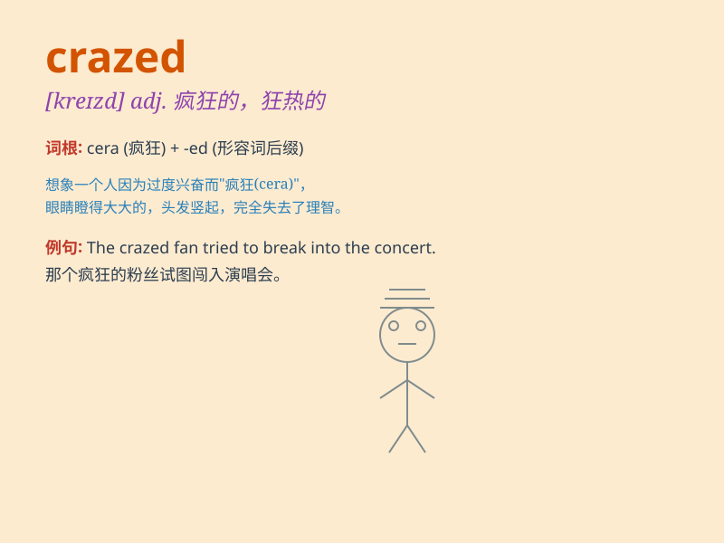

## crazed

**英音:** _[kreɪzd]_ **美音:** _[kreɪzd]_

**译义:** *adj.疯狂的,癫狂的*

### 短语

+ **crazed fan:** _狂热的粉丝_

+ **crazed behavior:** _疯狂的行为_

+ **crazed look:** _疯狂的表情_

+ **crazed driver:** _疯狂的司机_

+ **crazed pursuit:** _疯狂的追求_

### 例句

#### 例句1

> **The crazed fan rushed onto the stage to hug the singer.**

**中文翻译:** 疯狂的歌迷冲上舞台拥抱歌手。

**单词释义:** 疯狂的

#### 例句2

> **He has a crazed look in his eyes.**

**中文翻译:** 他的眼中带着疯狂的神色。

**单词释义:** 疯狂的；狂热的

#### 例句3

> **The crazed driver was speeding through the city streets.**

**中文翻译:** 疯狂的司机在城市街道上飞驰。

**单词释义:** 疯狂的；丧失理智的

### 背诵小故事

> A crazed monkey was running around the zoo, scaring all the visitors.
It jumped and screamed as if it had lost its mind. The zookeepers had a
hard time catching it. This shows how wild and out of control \'crazed\'
can be.

**一只疯狂的猴子在动物园里跑来跑去，吓到了所有游客。它又跳又叫，好像失去了理智。动物园管理员很难抓住它。这展现了\'crazed\'所表示的狂野和失控的样子。**

### 图义

