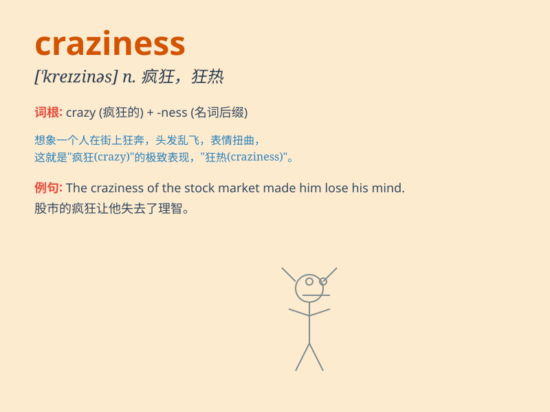

## craziness

**英音:** _[\'kreɪzinəs]_ **美音:** _[\'kreɪzinəs]_

**译义:** *n.发狂,热中,狂热*

### 短语

+ **moment of craziness:** _疯狂的时刻_

+ **total craziness:** _完全的疯狂_

+ **indulge in craziness:** _沉溺于疯狂_

+ **uncontrolled craziness:** _不受控制的疯狂_

+ **degree of craziness:** _疯狂的程度_

### 例句

#### 例句1

> **The craziness of the party lasted until dawn.**

**中文翻译:** 聚会的疯狂一直持续到黎明。

**单词释义:** 疯狂

#### 例句2

> **His craziness for extreme sports often worries his family.**

**中文翻译:** 他对极限运动的疯狂常常让他的家人担心。

**单词释义:** 狂热

#### 例句3

> **The craziness of the stock market makes investors cautious.**

**中文翻译:** 股市的疯狂让投资者变得谨慎起来。

**单词释义:** 疯狂

### 背诵小故事

> A man named Tom was always full of craziness. He would dance in the
rain, wear strange clothes, and do unexpected things. His craziness made
him stand out but also brought him lots of fun and unique experiences.

**一个叫汤姆的男人总是充满疯狂。他会在雨中跳舞，穿奇怪的衣服，做意想不到的事。他的疯狂让他与众不同，也给他带来了许多乐趣和独特的经历。**

### 图义

