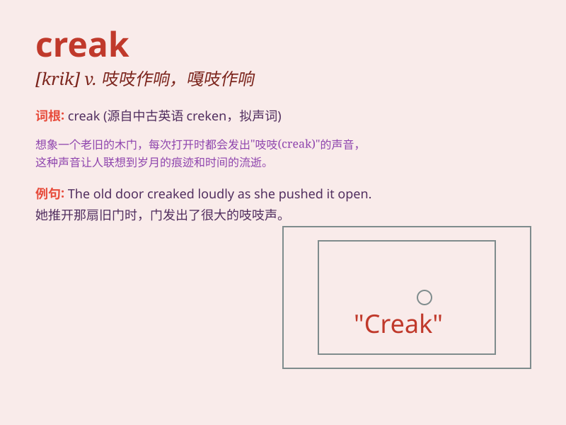

## creak

**英音:** _[kriːk]_ **美音:** _[krik]_

**译义:** *n.吱吱响声v.吱吱作响*

### 短语

+ **creak open:** _嘎吱一声打开_

+ **creak along:** _嘎吱嘎吱地前进_

+ **creak under:** _在\...下嘎吱作响_

+ **creak loudly:** _大声嘎吱作响_

+ **creak constantly:** _不停地嘎吱作响_

### 例句

#### 例句1

> **The old door creaked as I pushed it open.**

**中文翻译:** 当我推开那扇旧门时，它吱吱作响。

**单词释义:** 发出嘎吱声

#### 例句2

> **The wooden stairs creaked under his heavy footsteps.**

**中文翻译:** 木楼梯在他沉重的脚步声中嘎吱作响。

**单词释义:** 嘎吱作响

#### 例句3

> **The rusty hinges creaked when she opened the window.**

**中文翻译:** 当她打开窗户时，生锈的铰链吱吱作响。

**单词释义:** 嘎吱作响

### 背诵小故事

> One night, when I was alone in the old house, I heard a strange
sound. It was a creak. I followed the sound and found that it was the
door of the attic, moving slowly and making this creepy noise.

**一天晚上，当我独自在老房子里时，我听到了一个奇怪的声音。那是嘎吱声。我循着声音找去，发现是阁楼的门在缓慢移动，发出这种令人毛骨悚然的声音。**

### 图义

