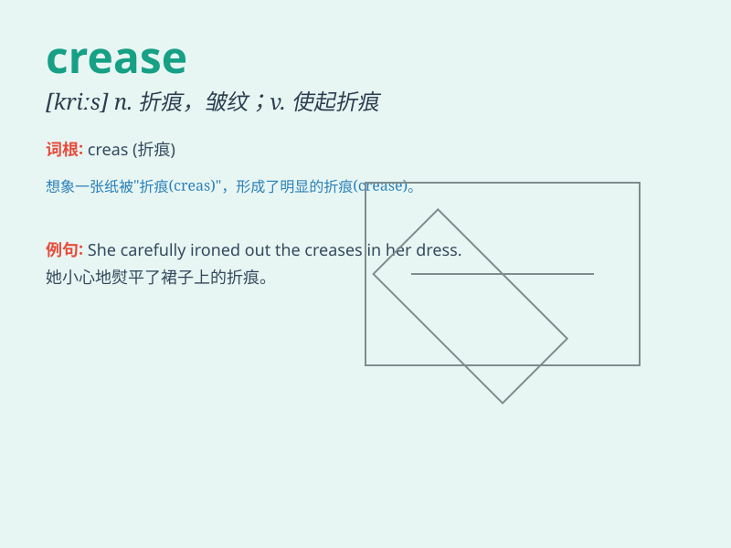

## crease

**英音:** _[kriːs]_ **美音:** _[kris]_

**译义:** *n.折缝,折痕v.折,弄皱*

### 短语

+ **crease mark:** _折痕标记_

+ **crease resistance:** _抗皱性_

+ **crease line:** _折线；折痕线_

+ **crease recovery:** _折皱回复_

+ **paper crease:** _纸张折痕_

### 例句

#### 例句1

> **The fabric has a crease down the middle.**

**中文翻译:** 布料的中间有一条折痕。

**单词释义:** 折痕；皱痕

#### 例句2

> **She carefully ironed the creases out of her shirt.**

**中文翻译:** 她小心翼翼地熨平衬衫上的折痕。

**单词释义:** 褶皱

#### 例句3

> **The book\'s cover had a crease from being dropped.**

**中文翻译:** 这本书的封面因掉落而产生了折痕。

**单词释义:** 折痕

### 背诵小故事

> A girl was folding a piece of paper. As she pressed hard, a crease
appeared. It was like a mark left by a magical touch. The crease made
the paper look special and unique.

**一个女孩正在折叠一张纸。当她用力按压时，出现了一道折痕。这就像神奇的触摸留下的印记。这道折痕让这张纸看起来特别且独一无二。**

### 图义

