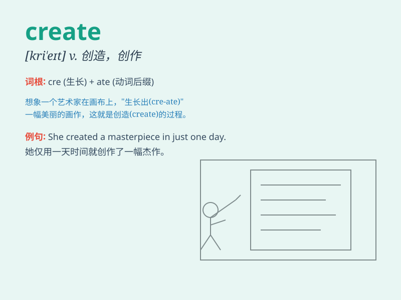

## create

**英音:** _[kriː\'eɪt]_ **美音:** _[krɪ\'et]_

**译义:** *vt.创造,创作,引起,造成*

### 短语

+ **create opportunities:** _创造机会_

+ **create problems:** _制造问题_

+ **create a scene:** _大吵大闹_

+ **create a sensation:** _引起轰动_

+ **create an impression:** _留下印象_

### 例句

#### 例句1

> **The artist creates beautiful paintings.**

**中文翻译:** 这位艺术家创作美丽的画作。

**单词释义:** 创作

#### 例句2

> **They decided to create a new business.**

**中文翻译:** 他们决定创建一家新企业。

**单词释义:** 创建

#### 例句3

> **The accident created a lot of problems.**

**中文翻译:** 这次事故造成了很多问题。

**单词释义:** 造成

### 背诵小故事

> Imagine a magical factory. Workers have nothing but empty space. With
their special tools and skills, they bring new things to life. This act
of making something from nothing is what \'create\' means.

**想象一个神奇的工厂。工人们一无所有，只有空荡荡的空间。凭借他们特殊的工具和技能，他们赋予新事物生命。这种从无到有的行为就是\'create\'的意思。**

### 图义

