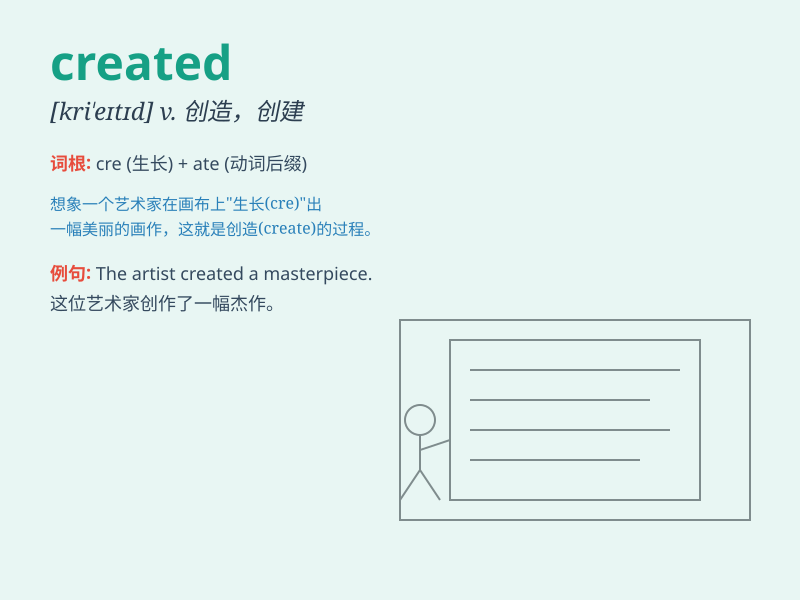

## created

**英音:** _[krɪ\'eɪtɪd]_ **美音:** _[krɪ\'etɪd]_

**译义:** *adj.创造的*

### 短语

+ **created by:** _由\...\...创造_

+ **created from:** _由\...\...制成_

+ **created for:** _为\...\...而创造_

+ **created with:** _用\...\...创造_

+ **be created:** _被创造_

### 例句

#### 例句1

> **The new software was created by a team of experts.**

**中文翻译:** 这款新软件是由一个专家团队创建的。

**单词释义:** 创建；创造

#### 例句2

> **A beautiful painting was created in just a few hours.**

**中文翻译:** 一幅美丽的画在短短几个小时内就创作出来了。

**单词释义:** 创作；产生

#### 例句3

> **The problem was created by his carelessness.**

**中文翻译:** 这个问题是由他的粗心造成的。

**单词释义:** 造成；引起

### 背诵小故事

> A young artist was struggling to create a masterpiece. One day,
inspired by a beautiful dream, he finally created a stunning painting.
The word \'created\' means to bring something into existence.

**一位年轻的艺术家一直在努力创作一幅杰作。有一天，受到一个美丽的梦的启发，他终于创作出了一幅令人惊叹的画。单词\'created\'的意思是使某物产生、形成。**

### 图义

