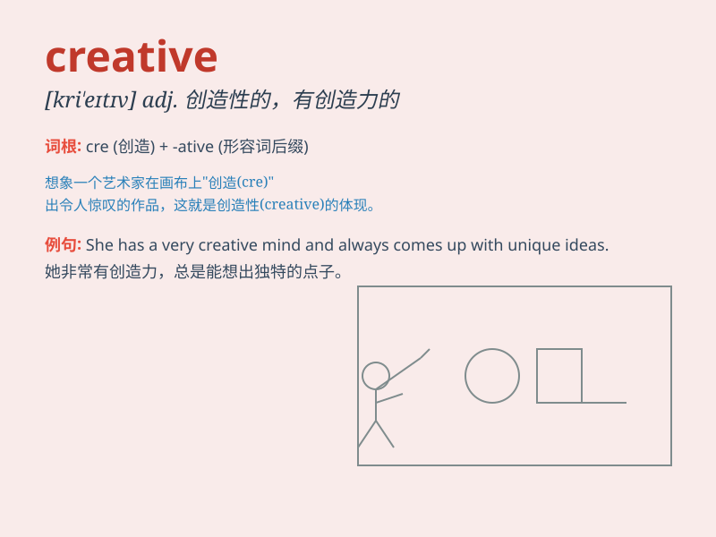

## creative

**英音:** _[kriː\'eɪtɪv]_ **美音:** _[krɪ\'etɪv]_

**译义:** *adj.创造性的*

### 短语

+ **creative thinking:** _创造性思维_

+ **creative writing:** _创意写作_

+ **creative process:** _创作过程_

+ **creative work:** _创造性工作_

+ **creative energy:** _创造力；创新能量_

### 例句

#### 例句1

> **She has a very creative mind and always comes up with unique
ideas.**

**中文翻译:** 她有一个非常有创造力的头脑，总是能想出独特的想法。

**单词释义:** 有创造力的

#### 例句2

> **The company encourages creative thinking among its employees.**

**中文翻译:** 这家公司鼓励员工进行创造性思考。

**单词释义:** 创造性的

#### 例句3

> **He is known for his creative approach to problem-solving.**

**中文翻译:** 他以解决问题的创新方法而闻名。

**单词释义:** 创新的

### 背诵小故事

> A young artist was always seeking new ways to express. One day, a
blank canvas inspired her. With a burst of imagination, she used colors
in unique ways. This made her creative works stand out. She became known
for her creative spirit.

**一位年轻的艺术家总是在寻求新的表达方式。有一天，一张空白的画布给了她灵感。凭借一阵想象，她以独特的方式使用色彩。这使她富有创意的作品脱颖而出。她因她的创新精神而闻名。**

### 图义

