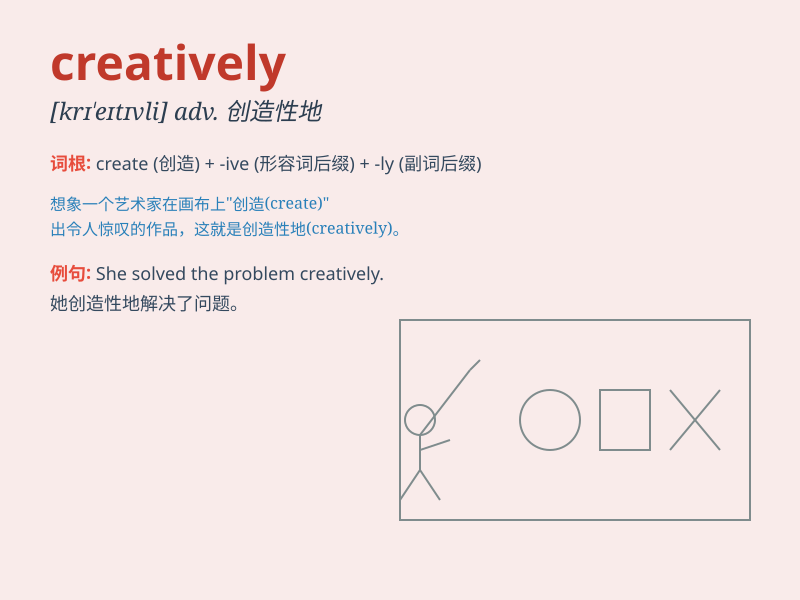

## creatively

**英音:** _[kriˈeɪ.tɪ.v.li]_ **美音:** _[kriˈeɪ.tɪv.li]_

**译义:** *副词，创造性地，以富有创新或想象力的方式；独创地*

### 短语

+ **think creatively:** _创造性地思考_

+ **express creatively:** _创造性地表达_

+ **solve problems creatively:** _创造性地解决问题_

+ **design creatively:** _创造性地设计_

+ **write creatively:** _创造性地写作_

### 例句

#### 例句1

> **She solved the problem creatively.**

**中文翻译:** 她创造性地解决了这个问题。

**单词释义:** 创造性地

#### 例句2

> **The artist expressed his ideas creatively in his paintings.**

**中文翻译:** 这位艺术家在他的画作中创造性地表达了他的想法。

**单词释义:** 创造性地

#### 例句3

> **They decorated the room creatively for the party.**

**中文翻译:** 他们为聚会创造性地装饰了房间。

**单词释义:** 创造性地

### 背诵小故事

> One day, a little artist was painting. He used colors and shapes
creatively. Instead of following the rules, he made a unique and
wonderful picture. That\'s how he showed his creatively.

**有一天，一位小艺术家在画画。他创造性地使用颜色和形状。不遵循常规，他创作了一幅独特而精彩的画。这就是他展现创造性的方式。**

### 图义

