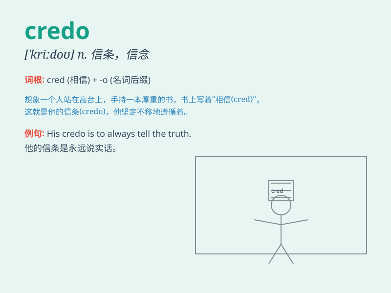

## credo

**英音:** _[\'kriːdəʊ; \'kreɪ-]_ **美音:** _[\'krido]_

**译义:** *n.[宗]信条,任何信条*

### 短语

+ **personal credo:** _个人信条_

+ **professional credo:** _职业信条_

+ **moral credo:** _道德信条_

+ **artistic credo:** _艺术信条_

+ **philosophical credo:** _哲学信条_

### 例句

#### 例句1

> **My personal credo is to always be kind and helpful to others.**

**中文翻译:** 我的个人信条是永远对他人友善和乐于助人。

**单词释义:** 信条；教义

#### 例句2

> **The company\'s credo emphasizes quality and customer
satisfaction.**

**中文翻译:** 这家公司的信条强调质量和客户满意度。

**单词释义:** 信条；原则

#### 例句3

> **She lives by the credo \'Honesty is the best policy.\'**

**中文翻译:** 她遵循"诚实为上策"的信条生活。

**单词释义:** 信条；格言

### 背诵小故事

> A brave knight always followed his credo \'Honor above all\' in every
battle. He believed that honor was the guiding principle of his actions.
This credo gave him strength and courage.

**一位勇敢的骑士在每场战斗中总是遵循他的信条'荣誉至上'。他认为荣誉是他行动的指导原则。这个信条给了他力量和勇气。**

### 图义

