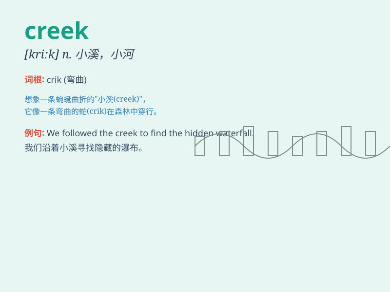

## creek

**英音:** _[kriːk]_ **美音:** _[krik]_

**译义:** *n.小溪,小河,\<主英>小港,小湾*

### 短语

+ **mountain creek:** _山涧_

+ **rocky creek:** _多石的小溪_

+ **dry creek:** _干涸的小溪_

+ **creek bed:** _溪床_

+ **meandering creek:** _蜿蜒的小溪_

### 例句

#### 例句1

> **The water in the creek is very clear.**

**中文翻译:** 小溪里的水非常清澈。

**单词释义:** 小溪

#### 例句2

> **They followed the creek until they reached the river.**

**中文翻译:** 他们沿着小溪一直走到河边。

**单词释义:** 小溪

#### 例句3

> **The children like to play by the creek on hot summer days.**

**中文翻译:** 在炎热的夏日，孩子们喜欢在小溪边玩耍。

**单词释义:** 小溪

### 背诵小故事

> One day, I was lost in the forest and came across a narrow creek. The
water was clear and flowed gently. I followed the creek and finally
found my way out. Remember, creek is a small stream.

**有一天，我在森林里迷路了，遇到了一条狭窄的小溪。溪水清澈，缓缓流淌。我沿着小溪走，最终找到了出路。记住，creek
就是小溪。**

### 图义

