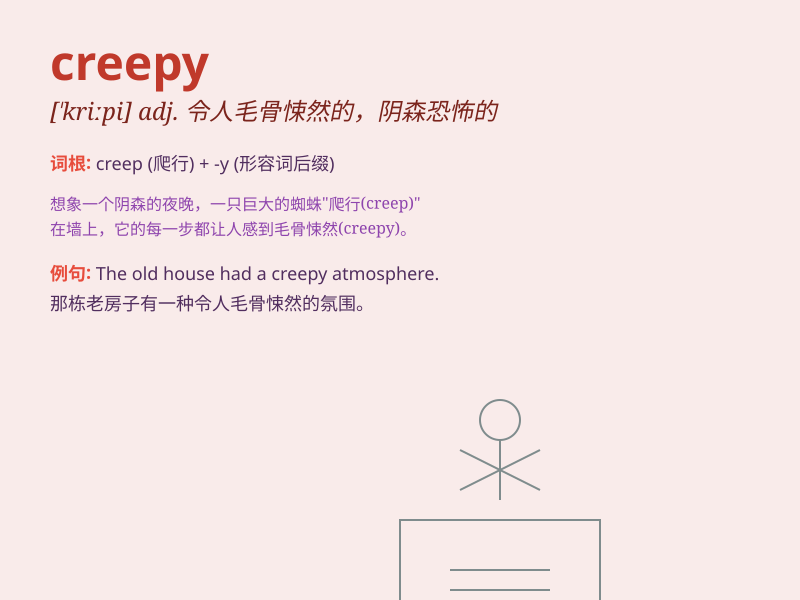

## creepy

**英音:** _[\'kriːpɪ]_ **美音:** _[\'kripi]_

**译义:** *adj.爬行的,匍匐的,皮肤上有足爬似的*

### 短语

+ **creepy crawly:** _令人毛骨悚然的爬行动物_

+ **creepy feeling:** _令人毛骨悚然的感觉_

+ **creepy place:** _令人害怕的地方_

+ **creepy story:** _令人毛骨悚然的故事_

+ **creepy smile:** _令人毛骨悚然的微笑_

### 例句

#### 例句1

> **The old house had a creepy atmosphere.**

**中文翻译:** 这座老房子有一种令人毛骨悚然的氛围。

**单词释义:** 令人毛骨悚然的

#### 例句2

> **There was a creepy guy lurking in the shadows.**

**中文翻译:** 有一个令人害怕的家伙潜伏在阴影中。

**单词释义:** 令人害怕的

#### 例句3

> **The creepy sound came from the abandoned building.**

**中文翻译:** 令人毛骨悚然的声音来自那座废弃的大楼。

**单词释义:** 令人毛骨悚然的

### 背诵小故事

> One night, I was walking alone in an old house. Suddenly, I heard
strange noises and saw shadows moving. The feeling was creepy, like
something unknown and scary was lurking around.

**一天晚上，我独自走在一座老房子里。突然，我听到奇怪的声音，看到阴影在移动。这种感觉很令人毛骨悚然，就像有未知且可怕的东西潜伏在周围。**

### 图义

