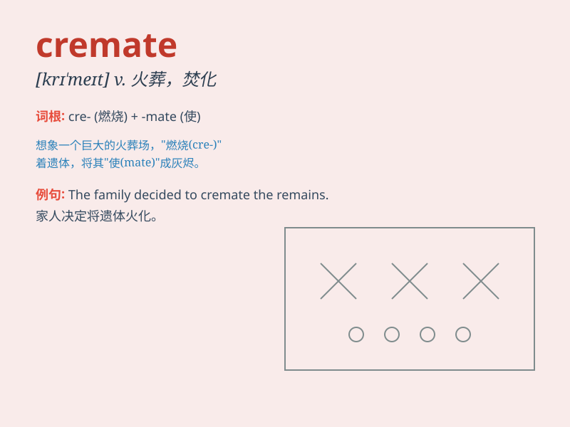

## cremate

**英音:** _[krɪ\'meɪt]_ **美音:** _[\'krimet]_

**译义:** *vt.火葬,焚化*

### 短语

+ **cremate the body:** _火化尸体_

+ **cremate remains:** _火化遗体_

+ **cremate someone:** _将某人火化_

+ **cremate the deceased:** _火化死者_

+ **cremate after death:** _死后火化_

### 例句

#### 例句1

> **The body was cremated after the funeral service.**

**中文翻译:** 葬礼仪式结束后，遗体被火化了。

**单词释义:** 火化

#### 例句2

> **They decided to cremate their beloved pet after its death.**

**中文翻译:** 他们决定在心爱的宠物死后将其火化。

**单词释义:** 火化

#### 例句3

> **In some cultures, it is a tradition to cremate the deceased.**

**中文翻译:** 在一些文化中，火化逝者是一种传统。

**单词释义:** 火化

### 背诵小故事

> A man lost his beloved wife. To give her a peaceful end, he chose to
cremate her. The fire burned gently, turning her body into ashes. It was
a sad but respectful farewell.

**一个男人失去了他心爱的妻子。为了给她一个安宁的结局，他选择火化她。火焰轻轻燃烧，将她的身体化为灰烬。这是一次悲伤但充满敬意的告别。**

### 图义

