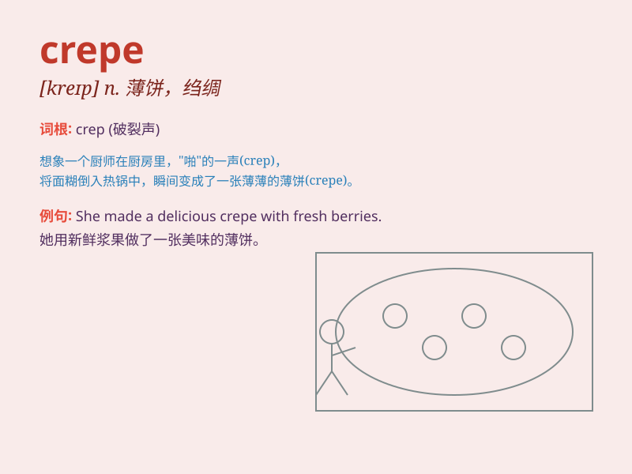

## crepe

**英音:** _[kreɪp]_ **美音:** _[krep]_

**译义:** *n.绉纱,绉绸*

### 短语

+ **crepe paper:** _绉纸_

+ **crepe sole:** _绉胶底_

+ **crepe de chine:** _双绉_

+ **banana crepe:** _香蕉薄饼_

+ **strawberry crepe:** _草莓可丽饼_

### 例句

#### 例句1

> **I had a delicious crepe filled with strawberries and cream for
dessert.**

**中文翻译:** 我吃了一个美味的夹有草莓和奶油的可丽饼当作甜点。

**单词释义:** 可丽饼

#### 例句2

> **The street vendor was selling freshly made crepes.**

**中文翻译:** 那个街头小贩正在售卖新鲜制作的可丽饼。

**单词释义:** 可丽饼

#### 例句3

> **She learned how to make crepes in her cooking class.**

**中文翻译:** 她在烹饪课上学了如何制作可丽饼。

**单词释义:** 可丽饼

### 背诵小故事

> One day, I went to a French bakery and saw a beautiful crepe. It was
thin and soft, filled with sweet strawberries and cream. The crepe
looked so delicious that I couldn\'t resist buying it.

**有一天，我去了一家法式面包店，看到了一个漂亮的可丽饼。它又薄又软，里面填满了甜甜的草莓和奶油。这个可丽饼看起来太美味了，我忍不住买了它。**

### 图义

