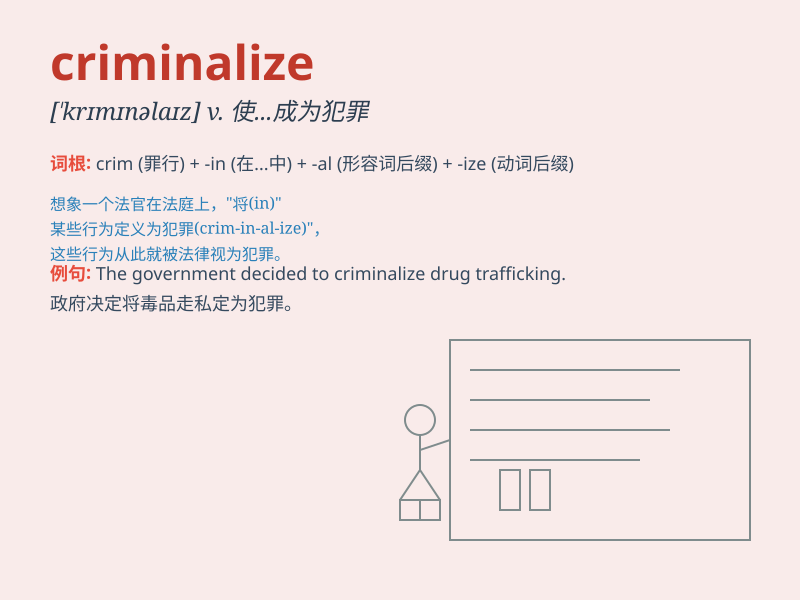

## criminalize

**英音:** _null_ **美音:** _null_

**译义:** *null*

### 短语

+ **criminalize behavior:** _将某种行为定为犯罪_

+ **criminalize an act:** _将某一行为定罪_

+ **criminalize drug use:** _将吸毒定为犯罪_

+ **criminalize certain activities:** _将某些活动定为犯罪_

+ **criminalize online fraud:** _将网络诈骗定罪_

### 例句

#### 例句1

> **The new law criminalizes certain online activities.**

**中文翻译:** 新的法律将某些网络活动定为犯罪。

**单词释义:** 把\...定为犯罪

#### 例句2

> **We should not criminalize minor mistakes.**

**中文翻译:** 我们不应该把小错误定为犯罪。

**单词释义:** 使\...成为犯罪行为

#### 例句3

> **Some countries criminalize drug use severely.**

**中文翻译:** 一些国家严厉地将吸毒定为犯罪。

**单词释义:** 判定\...有罪

### 背诵小故事

> A king wanted to control his kingdom strictly. So, he decided to
criminalize even the smallest bad behaviors. This made people very
scared. But in the end, his plan backfired and caused chaos.

**一位国王想要严格控制他的王国。于是，他决定把哪怕是最小的不良行为都定为犯罪。这让人们非常害怕。但最后，他的计划适得其反，引发了混乱。**

### 图义

