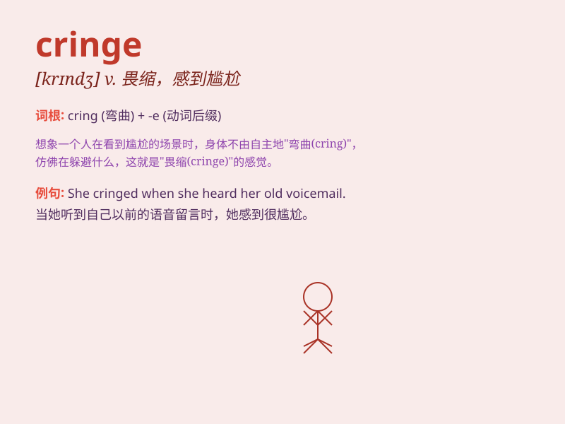

## cringe

**英音:** _[krɪn(d)ʒ]_ **美音:** _[krɪndʒ]_

**译义:** *vi.畏缩,阿谀,奉承*

### 短语

+ **cringe in fear:** _因恐惧而畏缩_

+ **cringe at the thought:** _一想到就感到不安_

+ **make someone cringe:** _使某人感到难为情_

+ **cringe with embarrassment:** _尴尬得畏缩_

+ **cringe away from:** _畏缩着躲开_

### 例句

#### 例句1

> **I cringe every time I think of that embarrassing moment.**

**中文翻译:** 每当我想起那个尴尬的时刻我都会感到畏缩。

**单词释义:** 感到难为情；畏缩

#### 例句2

> **The way he tells jokes makes me cringe.**

**中文翻译:** 他讲笑话的方式让我感到畏缩。

**单词释义:** 感到不舒服；厌恶

#### 例句3

> **She cringed at the sight of the spider.**

**中文翻译:** 她一看到蜘蛛就畏缩了。

**单词释义:** 退缩；畏缩

### 背诵小故事

> A mouse was in a big room. When a cat entered, the mouse cringed in
the corner, scared and trying to make itself small. It shows the meaning
of cringe - to shrink back in fear or nervousness.

**一只老鼠在一个大房间里。当一只猫进来时，老鼠在角落里畏缩着，很害怕并且试图把自己缩得小小的。这展现了
cringe 这个词的意思------因害怕或紧张而退缩。**

### 图义

