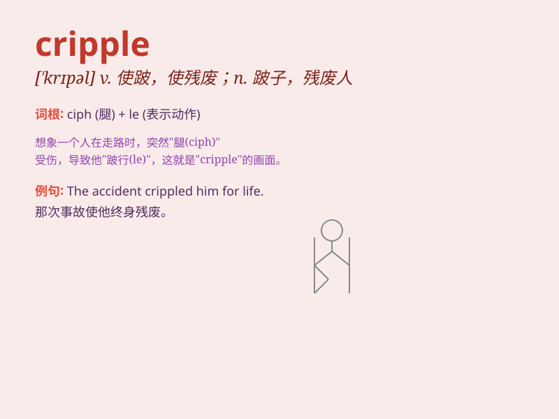

## cripple

**英音:** _[\'krɪp(ə)l]_ **美音:** _[\'krɪpl]_

**译义:** *n.跛子v.削弱*

### 短语

+ **cripple someone\'s career:** _毁掉某人的事业_

+ **be crippled by:** _因\...而致残_

+ **mental cripple:** _精神残疾者_

+ **cripple an economy:** _使经济瘫痪_

+ **cripple a plan:** _破坏一项计划_

### 例句

#### 例句1

> **The accident crippled him for life.**

**中文翻译:** 这次事故使他终身残疾。

**单词释义:** 使残废

#### 例句2

> **High taxes have crippled many small businesses.**

**中文翻译:** 高税收使许多小企业陷入瘫痪。

**单词释义:** 严重损害；削弱

#### 例句3

> **The strike crippled the factory\'s production.**

**中文翻译:** 罢工导致工厂生产瘫痪。

**单词释义:** 使瘫痪；使丧失功能

### 背诵小故事

> Once upon a time, there was a man who had an accident and became a
cripple. But he didn\'t give up and learned to use a wheelchair to move
around. His spirit inspired everyone around him.

**从前，有个人遭遇了一场事故变成了瘸子。但他没有放弃，学会了用轮椅四处移动。他的精神鼓舞了周围的每一个人。**

### 图义

