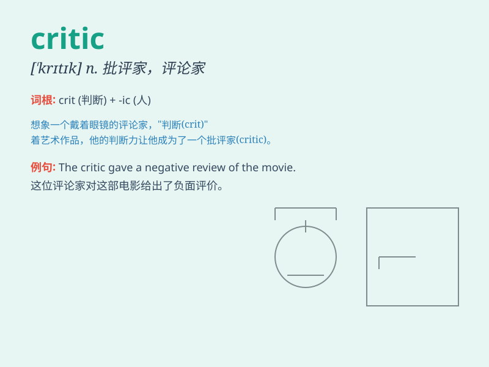

## critic

**英音:** _[\'krɪtɪk]_ **美音:** _[\'krɪtɪk]_

**译义:** *n.批评家,评论家,吹毛求疵者*

### 短语

+ **film critic:** _影评人_

+ **music critic:** _乐评人_

+ **art critic:** _艺术评论家_

+ **literary critic:** _文学评论家_

+ **food critic:** _美食评论家_

### 例句

#### 例句1

> **The critic praised the new play for its innovative plot.**

**中文翻译:** 评论家称赞新剧情节新颖。

**单词释义:** 评论家

#### 例句2

> **She has become a fierce critic of the government\'s policies.**

**中文翻译:** 她已成为政府政策的激烈批评者。

**单词释义:** 批评者

#### 例句3

> **The art critic analyzed the painting in detail.**

**中文翻译:** 艺术评论家详细分析了这幅画。

**单词释义:** 评论家

### 背诵小故事

> A critic was invited to a concert. But he was very picky and always
found faults. Later, he learned to appreciate the efforts of the
musicians. Now you know \'critic\' means a person who expresses opinions
about the good and bad parts of something.

**一位评论家被邀请去一场音乐会。但他非常挑剔，总是挑毛病。后来，他学会了欣赏音乐家的努力。现在你知道\'critic\'意思是对事物的好坏发表意见的人。**

### 图义

