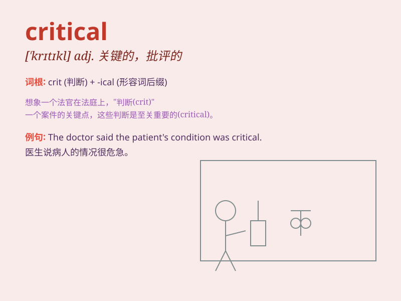

## critical

**英音:** _[\'krɪtɪk(ə)l]_ **美音:** _[\'krɪtɪkl]_

**译义:** *adj.评论的,鉴定的,批评的,危急的,临界的*

### 短语

+ **critical point:** _临界点；关键时刻_

+ **critical thinking:** _批判性思维；批判性思考_

+ **critical mass:** _临界质量_

+ **critical situation:** _危急情况；危急形势_

+ **critical period:** _关键时期；临界期_

### 例句

#### 例句1

> **The doctor\'s report was critical of the hospital\'s hygiene
standards.**

**中文翻译:** 医生的报告对医院的卫生标准提出了批评。

**单词释义:** 批评的；挑剔的

#### 例句2

> **We are at a critical moment in our history.**

**中文翻译:** 我们正处于历史的关键时刻。

**单词释义:** 关键的；危急的

#### 例句3

> **She has a critical eye for fashion.**

**中文翻译:** 她对时尚有着挑剔的眼光。

**单词释义:** 批判性的

### 背诵小故事

> A detective was in a critical situation. The criminal was about to
escape. But with his critical thinking, the detective found the key clue
and solved the case. It was a critical moment that needed sharp
judgment.

**一位侦探处于危急的情况中。罪犯即将逃跑。但凭借他批判性的思维，侦探找到了关键线索并破了案。这是一个需要敏锐判断的关键时刻。**

### 图义

