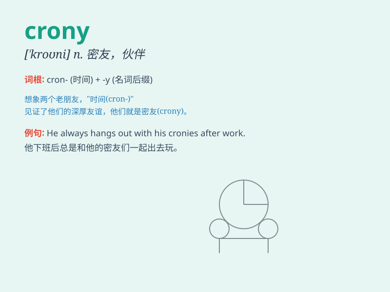

## crony

**英音:** _[\'krəʊnɪ]_ **美音:** _[\'kroni]_

**译义:** *n.\<美>任人唯亲,任用亲信*

### 短语

+ **crony capitalism:** _权贵资本主义；裙带资本主义_

+ **crony socialism:** _裙带社会主义_

+ **crony friend:** _密友；亲信朋友_

+ **crony network:** _裙带关系网_

+ **crony politics:** _裙带政治_

### 例句

#### 例句1

> **He got the job through his crony in the company.**

**中文翻译:** 他通过公司里的好友得到了这份工作。

**单词释义:** 好友；密友

#### 例句2

> **The politician was accused of favoring his cronies over the
public interest.**

**中文翻译:** 这位政客被指控偏袒他的密友而不顾公共利益。

**单词释义:** 密友；亲信

#### 例句3

> **She always hangs out with her cronies at the weekend.**

**中文翻译:** 她周末总是和她的好友们一起出去玩。

**单词释义:** 好友；朋党

### 背诵小故事

> 想象一下，有个国王总是和他的好友们一起玩乐，这些好友被称为
crony。国王无论做什么决策，这些 crony
总是无条件支持。后来国家出了问题，人们才发现这些 crony
只是因为关系好而不是有能力在帮忙。

**想象一个国王和他那些被称为\'密友\'的好友们的故事，借此理解\'crony\'（密友、好友）这个词。**

### 图义

