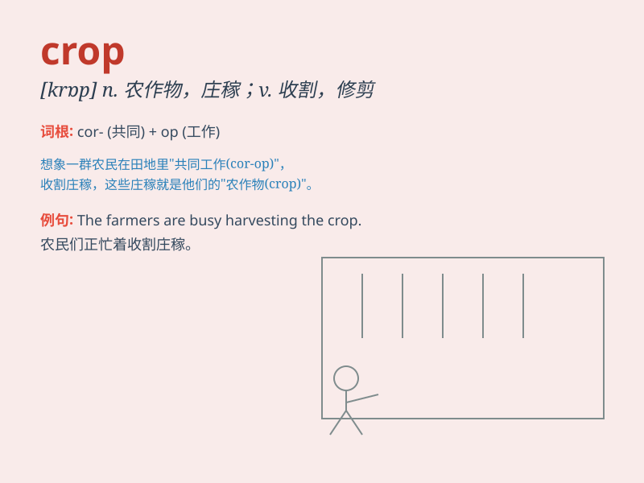

## crop

**英音:** _[krɒp]_ **美音:** _[krɑp]_

**译义:** *n.农作物,产量,平头,短发vt.收割,修剪,种植vi.收获*

### 短语

+ **crop up:** _突然出现；意外发生_

+ **a crop of:** _一批；一群；一系列_

+ **in crop:** _在耕种；在生长_

+ **out of crop:** _未耕种；未生长_

+ **crop rotation:** _轮作；作物轮种_

### 例句

#### 例句1

> **The farmer harvested a bumper crop of wheat this year.**

**中文翻译:** 这位农民今年收获了大量的小麦。

**单词释义:** 农作物；收成

#### 例句2

> **She had her hair cropped short.**

**中文翻译:** 她把头发剪短了。

**单词释义:** 剪短；修剪

#### 例句3

> **The photograph shows a group of children standing in a crop of
sunflowers.**

**中文翻译:** 这张照片展示了一群孩子站在一片向日葵地里。

**单词释义:** （土地的）庄稼；作物

### 背诵小故事

> A farmer was very worried about his crop. Because of the bad weather,
many of the plants were damaged. But with his hard work and care,
finally the crop grew well and he had a great harvest.

**一位农民非常担心他的庄稼。由于恶劣的天气，许多作物都受损了。但通过他的辛勤劳作和悉心照料，最终庄稼长得很好，他获得了大丰收。**

### 图义

