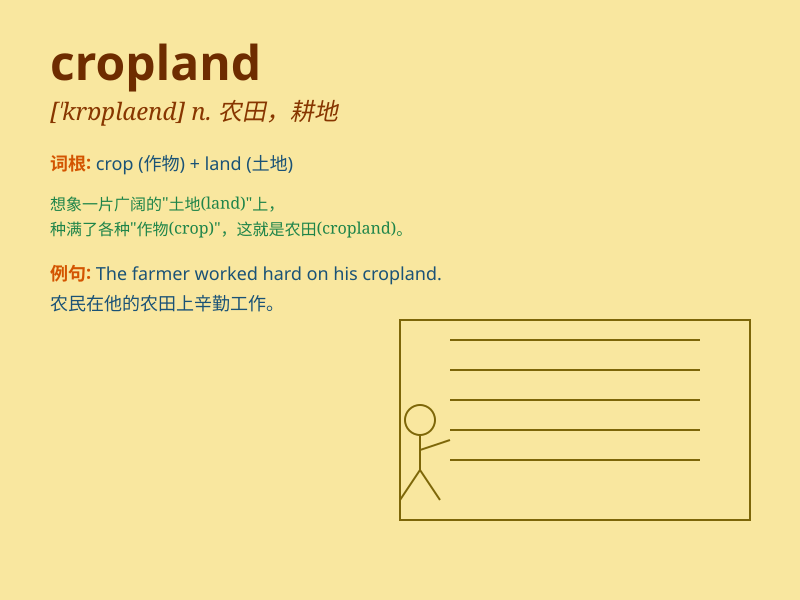

## cropland

**英音:** _[\'krɒp,lænd]_ **美音:** _[\'krɑp,lænd]_

**译义:** *n.农田,植作物之农地*

### 短语

+ **arable cropland:** _可耕农田_

+ **irrigated cropland:** _灌溉农田_

+ **intensive cropland:** _集约农田_

+ **vast cropland:** _广阔的农田_

+ **fertile cropland:** _肥沃的农田_

### 例句

#### 例句1

> **The government is working to protect the cropland from excessive
development.**

**中文翻译:** 政府正在努力保护农田免受过度开发。

**单词释义:** 农田

#### 例句2

> **The drought has severely damaged the cropland in this region.**

**中文翻译:** 干旱严重损害了这个地区的农田。

**单词释义:** 农田

#### 例句3

> **They are planning to expand their cropland to increase
agricultural production.**

**中文翻译:** 他们正计划扩大农田以提高农业产量。

**单词释义:** 农田

### 背诵小故事

> A farmer works hard every day on the cropland. He sows seeds, waters
the plants, and waits for a rich harvest. The cropland is his hope and
source of life.

**一位农民每天都在农田里辛勤劳作。他播种、浇水，等待着丰收。农田是他的希望和生活来源。**

### 图义

