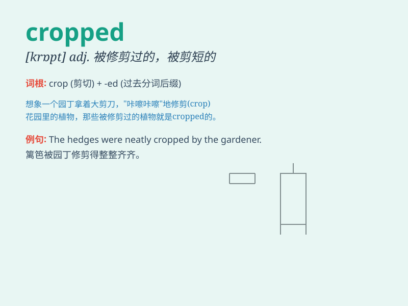

## cropped

**英音:** _[krɒpt]_ **美音:** _[krɑːpt]_

**译义:** *adj.
被修剪的；被收割的；被收割后的（crop的过去分词形式）*

### 短语

+ **cropped top:** _露脐上衣_

+ **cropped hair:** _短发；剪短的头发_

+ **cropped pants:** _七分裤；九分裤_

+ **cropped jacket:** _短款夹克_

+ **cropped image:** _裁剪后的图像_

### 例句

#### 例句1

> **She wore a cropped top and jeans.**

**中文翻译:** 她穿着一件短上衣和牛仔裤。

**单词释义:** 剪短的；缩短的（指上衣）

#### 例句2

> **The fields of wheat have been cropped.**

**中文翻译:** 这些麦田已经收割了。

**单词释义:** 收割；收获

#### 例句3

> **The photo was cropped to fit the frame.**

**中文翻译:** 这张照片被裁剪以适合相框。

**单词释义:** 修剪；裁切

### 背诵小故事

> A farmer was very happy because his crops were cropped successfully.
The harvested grains filled the barn. Cropped here means harvested or
cut short.

**一位农民非常高兴，因为他的庄稼成功收割了。收获的谷物装满了谷仓。这里的cropped意思是收割或剪短。**

### 图义

