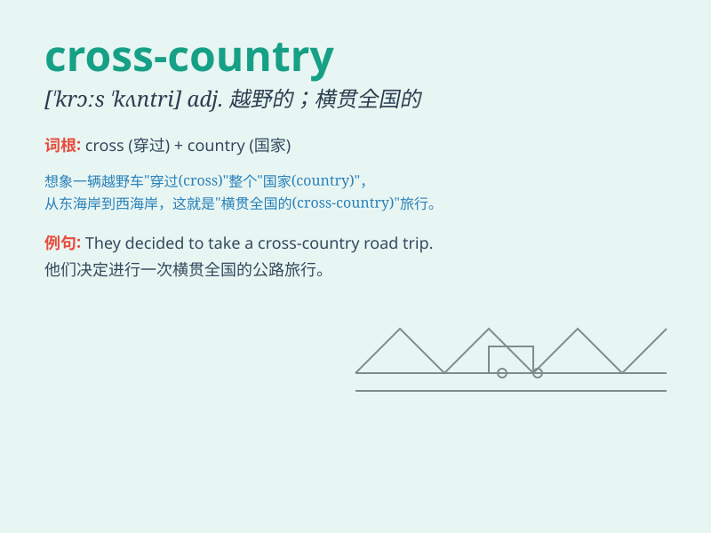

## cross-country

**英音:** _[krɒs-ˈkʌn.trɪ]_ **美音:** _[krɔs-ˈkʌn.tri]_

**译义:** *adj.跨国家的，横穿全国的；n.越野赛跑，越野滑雪*

### 短语

+ **cross-country race:** _越野赛跑_

+ **cross-country skiing:** _越野滑雪_

+ **cross-country flight:** _越野飞行_

+ **cross-country journey:** _越野旅行_

+ **cross-country motorcycle:** _越野摩托车_

### 例句

#### 例句1

> **He enjoys cross-country skiing in the winter.**

**中文翻译:** 他喜欢在冬天进行越野滑雪。

**单词释义:** 越野的；横越全国的

#### 例句2

> **The cross-country race was very challenging.**

**中文翻译:** 这场越野赛跑极具挑战性。

**单词释义:** 越野的

#### 例句3

> **They went on a cross-country trip by car.**

**中文翻译:** 他们驾车进行了一次越野旅行。

**单词释义:** 横越全国的

### 背诵小故事

> A brave athlete decided to take on a cross-country challenge. He ran
through mountains, forests, and fields. Despite facing many
difficulties, he kept going. Finally, he reached the finish line.
Cross-country means going across the country.

**一位勇敢的运动员决定接受越野挑战。他跑过山脉、森林和田野。尽管面临许多困难，他仍坚持前行。最终，他到达了终点线。cross-country
意思是越野的；横越全国的**

### 图义

