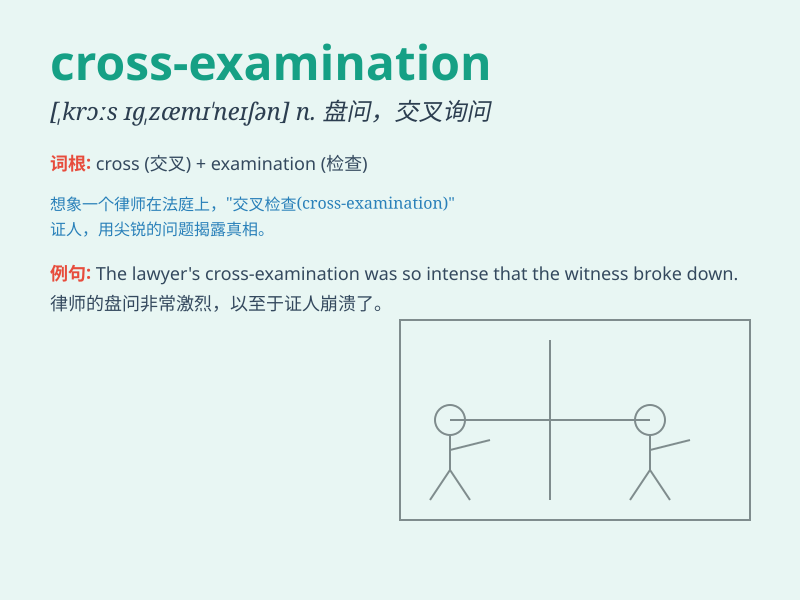

## cross-examination

**英音:** _[krɒs-ɪgˈzæm.ɪ.neɪ.ʃən]_ **美音:**
_[krɔs-ɪgˈzæm.ɪ.neɪ.ʃən]_

**译义:**
*n.交叉审问，对证盘问（尤指法庭上一方律师对另一方证人的盘问）*

### 短语

+ **conduct a cross-examination:** _进行交叉询问_

+ **under cross-examination:** _在交叉询问之下_

+ **intense cross-examination:** _激烈的交叉询问_

+ **skillful cross-examination:** _熟练的交叉询问_

+ **effective cross-examination:** _有效的交叉询问_

### 例句

#### 例句1

> **The witness underwent a rigorous cross-examination in court.**

**中文翻译:** 证人在法庭上接受了严格的盘问。

**单词释义:** 盘问；严密的询问

#### 例句2

> **The lawyer\'s cross-examination exposed the contradictions in the
defendant\'s testimony.**

**中文翻译:** 律师的盘问揭露了被告证词中的矛盾之处。

**单词释义:** 盘问；质问

#### 例句3

> **During the cross-examination, new evidence emerged.**

**中文翻译:** 在盘问过程中，新的证据出现了。

**单词释义:** 盘问；交叉询问

### 背诵小故事

> A lawyer was in a tense cross-examination. The witness was nervous.
The lawyer asked sharp questions to find the truth. It was like a battle
of wits in the courtroom.

**一位律师正在进行紧张的盘问。证人很紧张。律师提出尖锐的问题以探寻真相。这就像法庭上的一场智斗。**

### 图义

