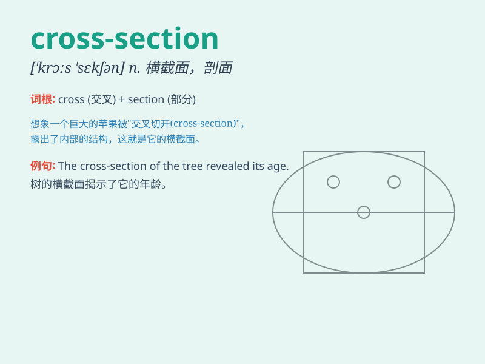

## cross-section

**英音:** _[ˈkrɒs.sekʃn]_ **美音:** _[ˈkrɔs.sɛkʃən]_

**译义:**
*n.横断面，截面；抽样；剖面图；vt.横断；对\...进行抽样检查*

### 短语

+ **cross-section view:** _横截面视图_

+ **cross-section analysis:** _横截面分析_

+ **random cross-section:** _随机横截面_

+ **typical cross-section:** _典型横截面_

+ **complex cross-section:** _复杂横截面_

### 例句

#### 例句1

> **The cross-section of the tree trunk showed the growth rings
clearly.**

**中文翻译:** 树干的横截面清晰地显示出了生长轮。

**单词释义:** 横截面

#### 例句2

> **A cross-section of society was represented at the event.**

**中文翻译:** 这次活动代表了社会的各个阶层。

**单词释义:** 代表部分；典型的一群

#### 例句3

> **The study examined a cross-section of the population.**

**中文翻译:** 这项研究对一部分人口进行了调查。

**单词释义:** 一部分；部分

### 背诵小故事

> Imagine a scientist cutting a big tree right across its middle. The
exposed part is like a cross-section. It shows the tree\'s inner
structure. Just like that, a cross-section gives us a view of the inside
of something.

**想象一位科学家从正中间切开一棵大树。暴露出来的部分就像是一个横截面。它展示了树的内部结构。就像这样，横截面能让我们看到某物的内部。**

### 图义

