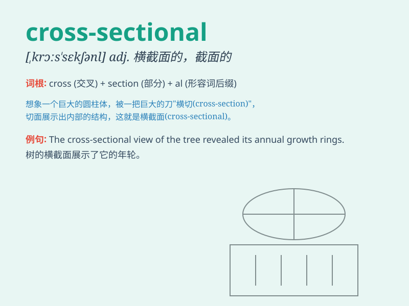

## cross-sectional

**英音:** _[ˌkrɒs ˈsɛkʃənəl]_ **美音:** _[ˌkrɔːs
ˈsɛkʃənəl]_

**译义:** *adj.横截面的；截面的；断面的；横断的*

### 短语

+ **cross-sectional area:** _横截面积_

+ **cross-sectional study:** _横断面研究；横断性研究_

+ **cross-sectional data:** _横截面数据；横断面数据_

+ **cross-sectional survey:** _横断面调查_

+ **cross-sectional view:** _横截面视图；横断面视图_

### 例句

#### 例句1

> **A cross-sectional study was conducted to investigate the
prevalence of the disease.**

**中文翻译:** 一项横断面研究被开展来调查这种疾病的流行情况。

**单词释义:** 横断面的；横截面式的

#### 例句2

> **The cross-sectional area of the pipe needs to be calculated
accurately.**

**中文翻译:** 管道的横截面积需要被精确计算。

**单词释义:** 横截面的

#### 例句3

> **The cross-sectional view of the building shows its unique
structure.**

**中文翻译:** 这座建筑的横截面视图展示了它独特的结构。

**单词释义:** 横截面的；横切的

### 背诵小故事

>
想象一下，有个科学家在研究不同年龄段人群的健康状况。他不是纵向跟踪一个人的变化，而是横向选取各个年龄段的人来对比，这种横向的、截面式的研究方式就是\'cross-sectional\'。

**想象科学家进行横向、截面式研究的场景来记住\'cross-sectional\'（横向的；截面的）这个单词**

### 图义

