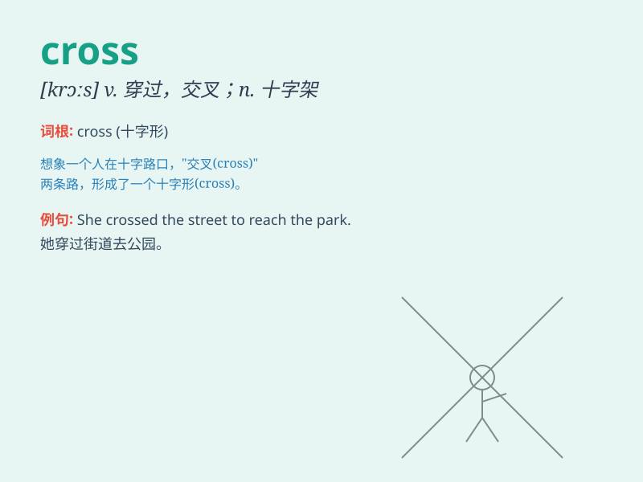

## cross

**英音:** _[krɒs]_ **美音:** _[krɔs]_

**译义:**
*n.十字,交叉,十字架,十字形物adj.交叉的,相反的,乖戾的v.使交叉,横过,勾划,错过,反对,杂交*

### 短语

+ **cross out:** _删去；划掉_

+ **cross over:** _跨越；穿过；转投另一方_

+ **cross off:** _划掉；取消_

+ **cross roads:** _十字路口；交叉路口_

+ **cross one\'s mind:** _突然想起；掠过心头_

### 例句

#### 例句1

> **I have to cross the street to get to the store.**

**中文翻译:** 我得穿过这条街才能到达商店。

**单词释义:** 穿过，越过

#### 例句2

> **She crossed her legs and sat down.**

**中文翻译:** 她交叉双腿坐了下来。

**单词释义:** 交叉

#### 例句3

> **He was cross with me for being late.**

**中文翻译:** 他因为我迟到而生气。

**单词释义:** 生气的

### 背诵小故事

> A brave knight had to cross a dangerous river to save the princess.
The river was wide and the current was strong, but he was determined.
Finally, he crossed it successfully and became a hero.

**一位勇敢的骑士必须穿过一条危险的河流去救公主。这条河很宽，水流很急，但他决心已定。最终，他成功地穿过了它，并成为了英雄。**

### 图义

