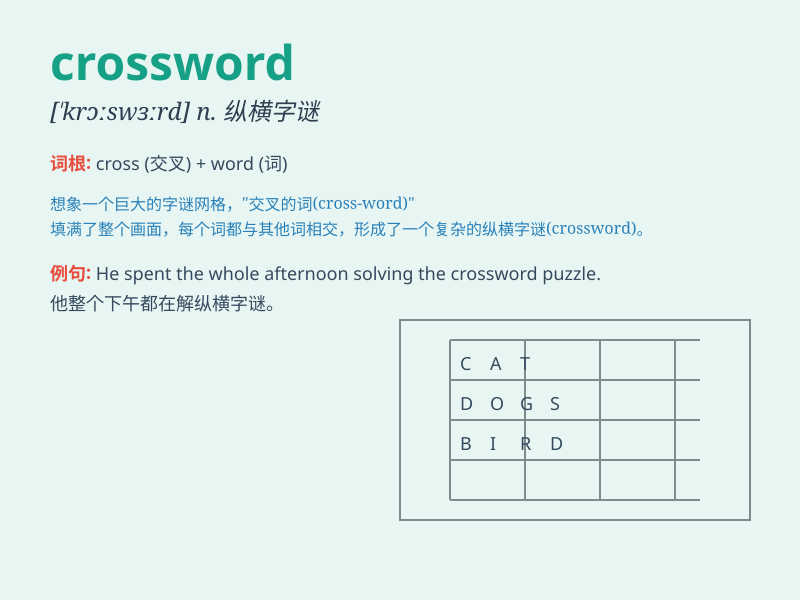

## crossword

**英音:** _[ˈkrɒswɜːd]_ **美音:** _[ˈkrɔːswɜːrd]_

**译义:** *n.纵横字谜*

### 短语

+ **do a crossword:** _做填字游戏_

+ **crossword puzzle:** _纵横字谜_

+ **solve a crossword:** _解答填字游戏_

+ **complex crossword:** _复杂的填字游戏_

+ **easy crossword:** _简单的填字游戏_

### 例句

#### 例句1

> **I enjoy doing crossword puzzles in my spare time.**

**中文翻译:** 我喜欢在业余时间做填字游戏。

**单词释义:** 填字游戏

#### 例句2

> **She spent hours solving the difficult crossword.**

**中文翻译:** 她花了几个小时解决这个困难的填字游戏。

**单词释义:** 填字题

#### 例句3

> **The newspaper always has a crossword on the last page.**

**中文翻译:** 报纸的最后一页总是有填字游戏。

**单词释义:** 填字游戏

### 背诵小故事

> One day, Tom was stuck at home. To have fun, he started doing a
crossword. It was like a puzzle adventure. He crossed words here and
there, trying to fill the empty boxes. Finally, he solved it and felt so
happy!

**一天，汤姆被困在家里。为了找点乐子，他开始做填字游戏。这就像一场解谜冒险。他到处交叉填写单词，试图填满空框。最后，他解开了谜题，感到非常开心！**

### 图义

