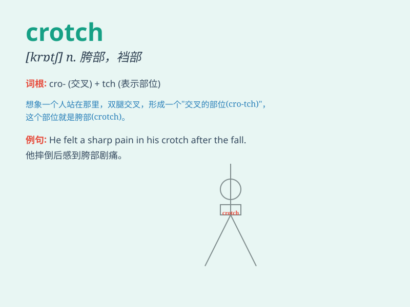

## crotch

**英音:** _[krɒtʃ]_ **美音:** _[krɑtʃ]_

**译义:** *n.分叉处,丫叉,胯部*

### 短语

+ **crotch area:** _胯部区域_

+ **crotch pain:** _胯部疼痛_

+ **crotch height:** _胯部高度_

+ **crotch of a tree:** _树的分叉处_

+ **crotch of trousers:** _裤子的裆部_

### 例句

#### 例句1

> **He had a rash in his crotch.**

**中文翻译:** 他的胯部出现了皮疹。

**单词释义:** 胯部

#### 例句2

> **The monkey climbed up the tree and sat in the crotch of a
branch.**

**中文翻译:** 猴子爬上树，坐在树枝的胯下。

**单词释义:** 分叉处

#### 例句3

> **The tailor measured the crotch of the pants to ensure a proper
fit.**

**中文翻译:** 裁缝测量了裤子的裤裆，以确保合身。

**单词释义:** 裆部

### 背诵小故事

> A thief was hiding in the crotch of a big tree, thinking he wouldn\'t
be found. But a smart detective noticed the odd shape in the crotch and
caught him. The crotch here is the part where the branches meet the
trunk.

**一个小偷藏在一棵大树的杈桠处，以为不会被发现。但聪明的侦探注意到杈桠处的奇怪形状并抓住了他。这里的
crotch 指的是树枝与树干相接的部位。**

### 图义

