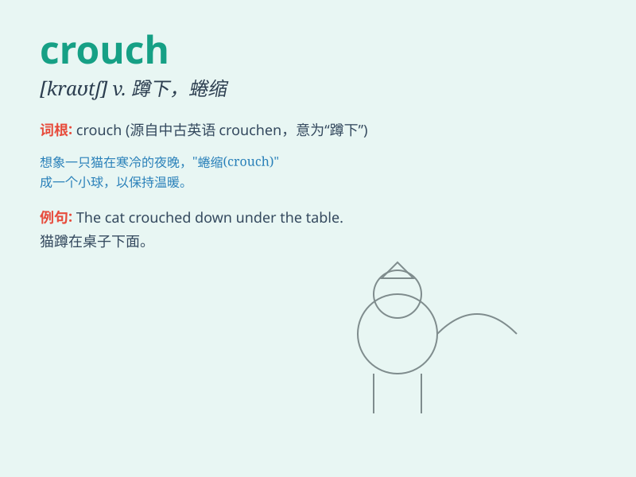

## crouch

**英音:** _[kraʊtʃ]_ **美音:** _[kraʊtʃ]_

**译义:** *vi.蜷缩,蹲伏*

### 短语

+ **crouch down:** _蹲下_

+ **crouch low:** _蹲得很低_

+ **crouch behind:** _蹲在\...后面_

+ **crouch in fear:** _因恐惧而蹲伏_

+ **crouch motionless:** _一动不动地蹲着_

### 例句

#### 例句1

> **He crouched down behind the wall.**

**中文翻译:** 他蹲在墙后。

**单词释义:** 蹲下

#### 例句2

> **The cat crouched ready to pounce.**

**中文翻译:** 猫蹲下准备扑过去。

**单词释义:** 蹲伏

#### 例句3

> **She crouched low to avoid being seen.**

**中文翻译:** 她蹲得很低，以免被看见。

**单词释义:** 蹲低

### 背诵小故事

> A thief was trying to steal jewels. To hide from the guards, he had
to crouch behind a big box. He stayed in that crouched position, hardly
breathing, until the danger passed.

**一个小偷试图偷珠宝。为了躲避警卫，他不得不蹲在一个大箱子后面。他一直保持着蹲着的姿势，几乎不敢呼吸，直到危险过去。**

### 图义

