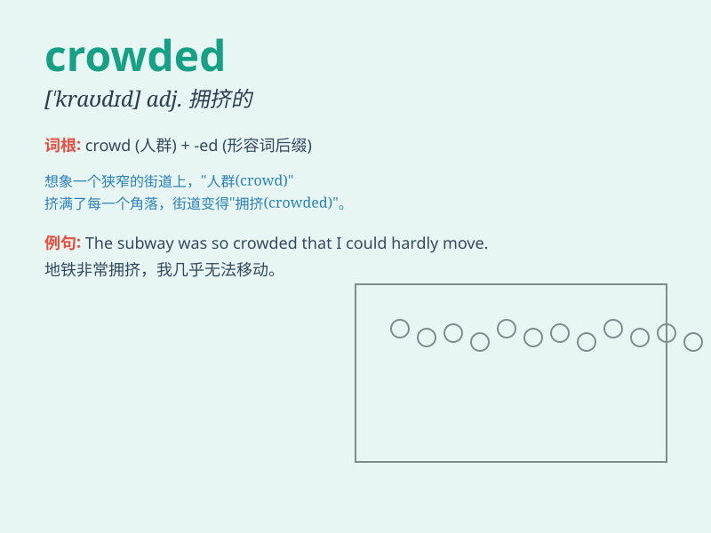

## crowded

**英音:** _[\'kraʊdɪd]_ **美音:** _[\'kraʊdɪd]_

**译义:** *adj.拥挤的,塞满的*

### 短语

+ **be crowded with:** _挤满；充满_

+ **crowded place:** _拥挤的地方_

+ **crowded market:** _拥挤的市场_

+ **crowded street:** _拥挤的街道_

+ **a crowded train:** _拥挤的火车_

### 例句

#### 例句1

> **The train was crowded with passengers.**

**中文翻译:** 火车上挤满了乘客。

**单词释义:** 拥挤的

#### 例句2

> **The market was so crowded that I could hardly move.**

**中文翻译:** 市场太拥挤了，我几乎无法移动。

**单词释义:** 拥挤的

#### 例句3

> **The beach was crowded with tourists on the weekend.**

**中文翻译:** 周末海滩上挤满了游客。

**单词释义:** 拥挤的

### 背诵小故事

> One day, I went to a fair. There were so many people everywhere. The
paths were filled with people. It was a crowded place. I could hardly
move. But it was still fun.

**有一天，我去了一个集市。到处都是好多人。道路上挤满了人。这是一个拥挤的地方。我几乎动弹不得。但仍然很有趣。**

### 图义

