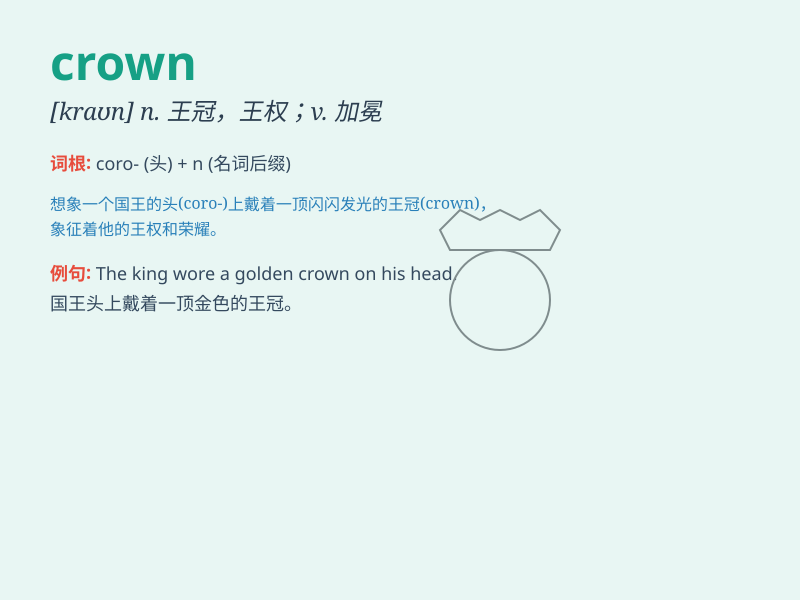

## crown

**英音:** _[kraʊn]_ **美音:** _[kraʊn]_

**译义:** *n.王冠,花冠,顶vt.加冕,顶上有,表彰,使圆满完成*

### 短语

+ **crown prince:** _王储；皇太子_

+ **crown jewels:** _（镶有宝石的）王冠，权杖和御宝_

+ **crown of thorns:** _荆冠；受难的象征_

+ **crown land:** _王室领地；公有土地_

+ **crown court:** _（英国的）刑事法庭_

### 例句

#### 例句1

> **The king wore a magnificent crown during the ceremony.**

**中文翻译:** 国王在仪式上戴着一顶华丽的王冠。

**单词释义:** 王冠

#### 例句2

> **She was crowned the beauty queen of the town.**

**中文翻译:** 她被加冕为镇上的选美皇后。

**单词释义:** 为...加冕

#### 例句3

> **The mountain peak was crowned with snow all year round.**

**中文翻译:** 山峰终年积雪。

**单词释义:** 覆盖；使成顶状

### 背诵小故事

> The king wore a magnificent crown. It was shiny and had precious
jewels. Everyone bowed when they saw the crown, as it symbolized the
king\'s power and authority.

**国王戴着一顶华丽的王冠。它闪闪发光，上面镶嵌着珍贵的宝石。当大家看到这顶王冠时都纷纷鞠躬，因为它象征着国王的权力和权威。**

### 图义

