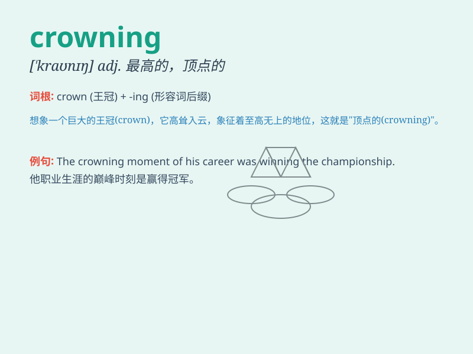

## crowning

**英音:** _[\'kraʊnɪŋ]_ **美音:** _[\'kraʊnɪŋ]_

**译义:** *adj.最高的,无比的*

### 短语

+ **crowning achievement:** _最高成就；最伟大的成就_

+ **crowning glory:** _至高无上的荣耀；最辉煌的部分_

+ **crowning moment:** _最辉煌的时刻；巅峰时刻_

+ **crowning touch:** _点睛之笔；画龙点睛的一笔_

+ **crowning ceremony:** _加冕典礼_

### 例句

#### 例句1

> **The crowning achievement of his career was winning the Nobel
Prize.**

**中文翻译:** 他职业生涯的最高成就是获得诺贝尔奖。

**单词释义:** 最高的；无比的

#### 例句2

> **The crowning moment of the ceremony was the lighting of the
Olympic torch.**

**中文翻译:** 仪式的最高潮是奥运火炬的点燃。

**单词释义:** 最伟大的；最重要的

#### 例句3

> **The crowning glory of the garden is the beautiful rose bed.**

**中文翻译:** 花园的最高荣耀是美丽的玫瑰花坛。

**单词释义:** 顶点的；绝顶的

### 背诵小故事

> The king was about to put on the crowning jewel of his crown. But
suddenly, a bird flew and snatched it away. This was the most unexpected
and crowning moment of the ceremony.

**国王即将戴上他王冠上的那颗最璀璨的宝石。但突然，一只鸟飞来把它抢走了。这是典礼上最出乎意料和最重要的时刻。**

### 图义

