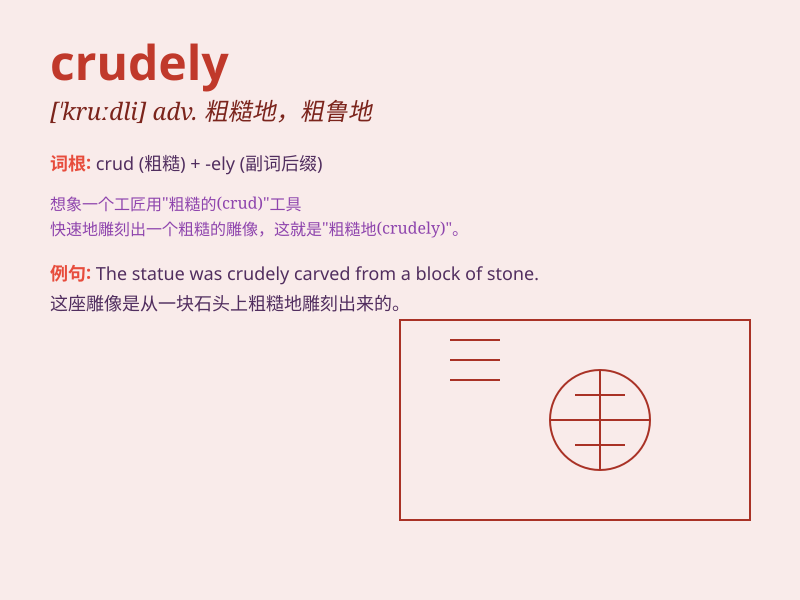

## crudely

**英音:** _[kruːdli]_ **美音:** _[kruːdli]_

**译义:** *adv.照自然状态,不成熟地,粗杂地*

### 短语

+ **crudely made:** _制作粗糙_

+ **crudely drawn:** _画得粗糙_

+ **crudely expressed:** _表达粗略_

+ **crudely constructed:** _建造粗糙_

+ **crudely packaged:** _包装简陋_

### 例句

#### 例句1

> **The sculpture was crudely made, lacking finesse and detail.**

**中文翻译:** 雕塑制作粗糙，缺乏技巧和细节。

**单词释义:** 粗糙地；简陋地

#### 例句2

> **He crudely expressed his dissatisfaction with the decision.**

**中文翻译:** 他粗暴地表达了对这一决定的不满。

**单词释义:** 粗鲁地；粗俗地

#### 例句3

> **The machine was crudely assembled and prone to breakdowns.**

**中文翻译:** 该机器组装粗糙，容易出现故障。

**单词释义:** 粗糙地；粗制滥造地

### 背诵小故事

> A painter crudely smeared colors on the canvas, not caring about the
details. People criticized his work for being so rough and unrefined.
This shows what \'crudely\' means - in a rough and unskilled way.

**一位画家在画布上粗暴地涂抹颜料，不在乎细节。人们批评他的作品太粗糙和不精细。这展示了\'crudely\'的意思------以粗糙和不熟练的方式。**

### 图义

