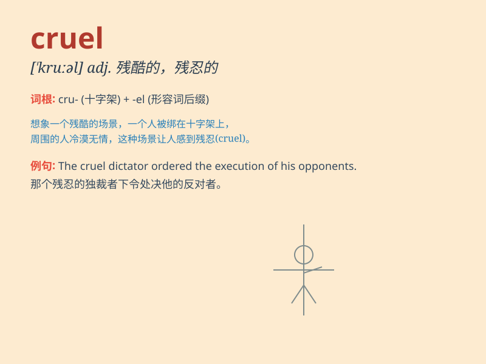

## cruel

**英音:** _[krʊəl]_ **美音:** _[kruəl]_

**译义:** *adj.残酷的,悲惨的,使痛苦的*

### 短语

+ **cruel joke:** _残酷的玩笑_

+ **cruel punishment:** _残酷的惩罚_

+ **cruel fate:** _残酷的命运_

+ **cruel reality:** _残酷的现实_

+ **be cruel to:** _对\...\...残忍_

### 例句

#### 例句1

> **The cruel king punished his subjects severely.**

**中文翻译:** 残酷的国王严厉地惩罚了他的臣民。

**单词释义:** 残忍的

#### 例句2

> **It was cruel of him to abandon his sick wife.**

**中文翻译:** 他抛弃生病的妻子，实在是太残忍了。

**单词释义:** 残忍的

#### 例句3

> **The cruel reality made him lose hope.**

**中文翻译:** 残酷的现实让他失去了希望。

**单词释义:** 残酷的

### 背诵小故事

> A king was very cruel. He punished people for no good reason. One
day, a brave girl stood up and said, \'Your cruelty must stop!\'
Finally, the king changed. Remember, cruel means being mean and causing
pain to others.

**一位国王非常残忍。他毫无理由地惩罚人们。一天，一个勇敢的女孩站出来说：'你的残忍必须停止！'最后，国王改变了。记住，cruel
意思是残忍的，给他人带来痛苦。**

### 图义

