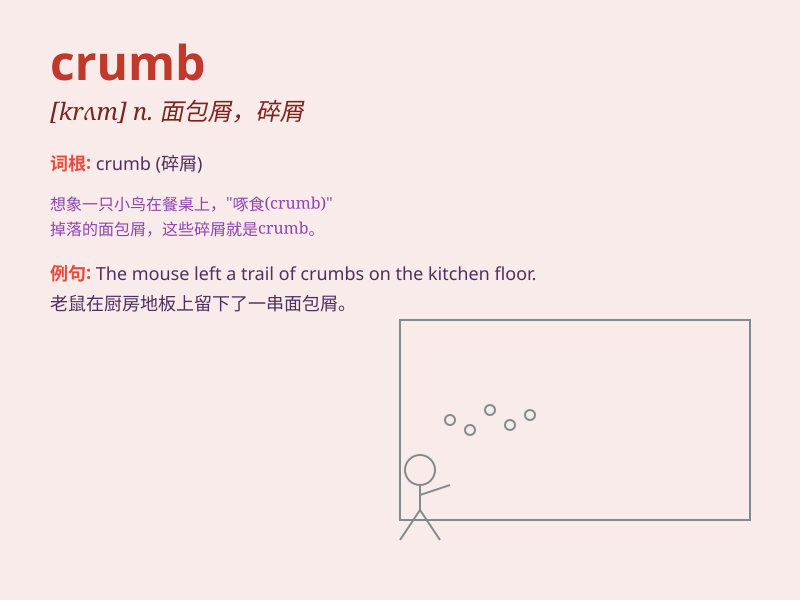

## crumb

**英音:** _[krʌm]_ **美音:** _[krʌm]_

**译义:** *n.碎屑,面包屑,少许vt.搓碎,弄碎*

### 短语

+ **crumb cake:** _面包屑蛋糕_

+ **crumb rubber:** _粒状生胶_

+ **crumb structure:** _团粒结构_

+ **collect crumbs:** _收集面包屑_

+ **drop crumbs:** _掉落面包屑_

### 例句

#### 例句1

> **The cake was full of crumbs.**

**中文翻译:** 蛋糕里满是面包屑。

**单词释义:** 碎屑；面包屑；糕饼屑

#### 例句2

> **She swept up the crumbs from the table.**

**中文翻译:** 她把桌上的面包屑扫掉。

**单词释义:** 碎屑

#### 例句3

> **The bird pecked at the crumbs on the ground.**

**中文翻译:** 那只鸟啄食地上的面包屑。

**单词释义:** 面包屑

### 背诵小故事

> A hungry mouse was looking for food in a big kitchen. It finally
found some crumbs on the table. The crumbs were so small but they made
the mouse happy.

**一只饥饿的老鼠在一个大厨房寻找食物。它最终在桌子上发现了一些面包屑。这些面包屑很小，但让老鼠很开心。**

### 图义

