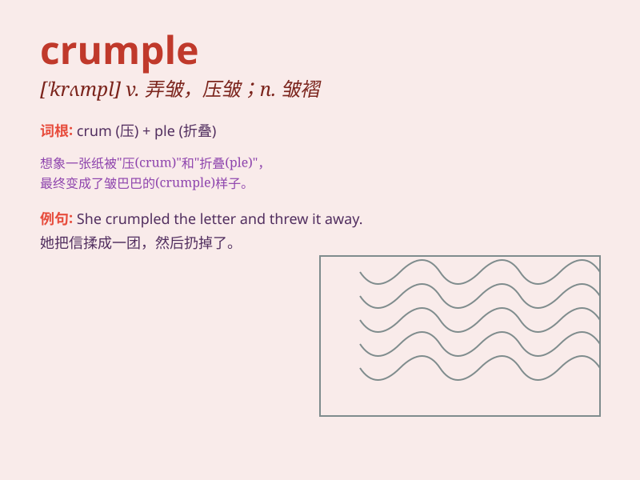

## crumple

**英音:** _[\'krʌmp(ə)l]_ **美音:** _[\'krʌmpl]_

**译义:** *v.弄皱,压皱,变皱,崩溃,垮台*

### 短语

+ **crumple up:** _揉皱；使起皱_

+ **crumple into:** _（因无力、痛苦等）瘫倒；崩溃_

+ **crumple sth. down:** _把某物弄皱或压皱_

+ **crumple under pressure:** _在压力下崩溃_

+ **crumple sth. in one\'s hand:** _在手中把某物揉皱_

### 例句

#### 例句1

> **The paper crumpled easily in her hand.**

**中文翻译:** 这张纸在她手里很容易就皱巴巴的。

**单词释义:** （使）变皱；起皱

#### 例句2

> **He crumpled the letter and threw it in the bin.**

**中文翻译:** 他把信揉成一团，扔进了垃圾桶。

**单词释义:** 揉皱；弄皱

#### 例句3

> **The old car crumpled up in the accident.**

**中文翻译:** 那辆旧车在事故中毁坏了。

**单词释义:** （使）倒塌；（使）垮掉

### 背诵小故事

> One day, I was carrying a stack of papers. Suddenly, I tripped and
fell. The papers crumpled under my weight. It looked like a mess!

**一天，我拿着一叠纸。突然，我绊了一跤摔倒了。那些纸在我的重压下皱了起来。看起来一团糟！**

### 图义

