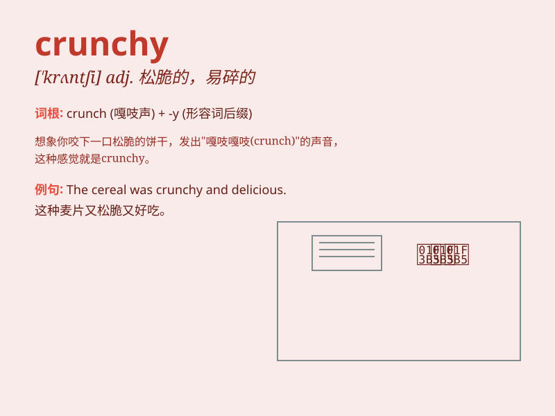

## crunchy

**英音:** _[\'krʌntʃɪ]_ **美音:** _[\'krʌntʃi]_

**译义:** *adj.发嘎吱嘎吱声的,易碎的*

### 短语

+ **crunchy peanut butter:** _脆花生酱_

+ **crunchy vegetables:** _脆口的蔬菜_

+ **crunchy snack:** _松脆的小吃_

+ **crunchy leaves:** _嘎吱作响的树叶_

+ **crunchy texture:** _松脆的质地_

### 例句

#### 例句1

> **I love eating crunchy cookies.**

**中文翻译:** 我喜欢吃松脆的饼干。

**单词释义:** 脆脆的

#### 例句2

> **The snow was crunchy under our boots.**

**中文翻译:** 雪在我们的靴子下嘎吱作响。

**单词释义:** 嘎吱作响的

#### 例句3

> **These crunchy vegetables are very fresh.**

**中文翻译:** 这些脆脆的蔬菜非常新鲜。

**单词释义:** 脆脆的

### 背诵小故事

> A little rabbit was walking in the forest and found some crunchy
carrots. When it bit into them, it heard a pleasant crunching sound. The
sound made the rabbit very happy. The carrots were so crunchy and
delicious!

**一只小兔子在森林里散步，发现了一些脆脆的胡萝卜。当它咬下去时，听到了悦耳的嘎吱声。这个声音让小兔子非常开心。这些胡萝卜又脆又美味！**

### 图义

