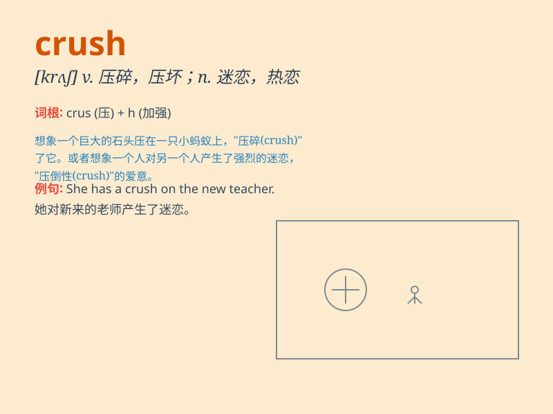

## crush

**英音:** _[krʌʃ]_ **美音:** _[krʌʃ]_

**译义:** *vt.压碎,碾碎,压服,压垮,粉碎,(使)变形*

### 短语

+ **have a crush on:** _迷恋；喜欢上_

+ **crush out:** _扑灭；熄灭_

+ **crush up:** _粉碎；捣碎_

+ **crush resistance:** _抗压强度_

+ **crush injury:** _挤压伤_

### 例句

#### 例句1

> **I have a crush on him.**

**中文翻译:** 我迷恋他。

**单词释义:** 迷恋，爱慕

#### 例句2

> **The car was completely crushed in the accident.**

**中文翻译:** 事故中汽车完全被毁。

**单词释义:** 压坏，压碎

#### 例句3

> **The crowd crushed through the gate.**

**中文翻译:** 人群挤进了大门。

**单词释义:** 挤，压

### 背诵小故事

> I had a huge crush on a classmate. Every time I saw her smile, my
heart raced. One day, I finally gathered the courage to talk to her.
\'Crush\' means a strong but short-lived infatuation.

**我深深地暗恋着一位同学。每次看到她的笑容，我的心都狂跳不已。有一天，我终于鼓起勇气和她说话。"crush"意思是短暂而强烈的迷恋。**

### 图义

