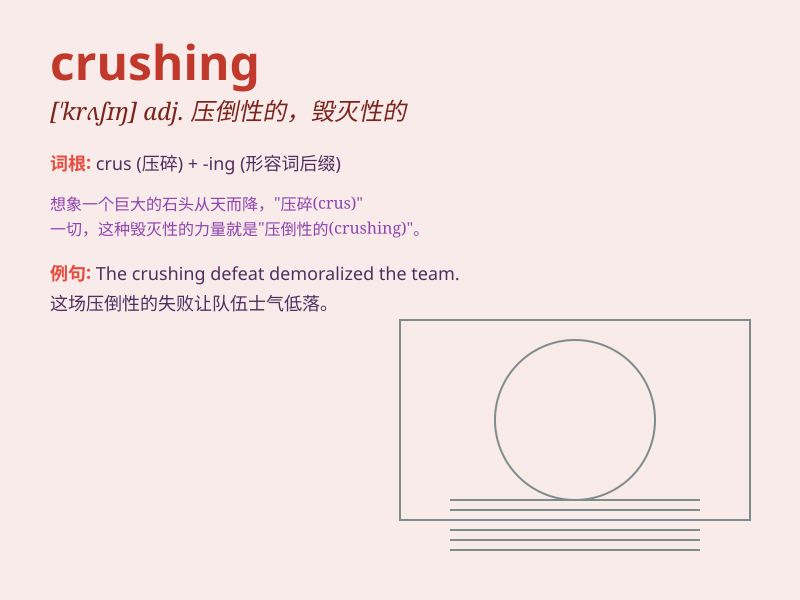

## crushing

**英音:** _[\'krʌʃɪŋ]_ **美音:** _[\'krʌʃɪŋ]_

**译义:** *adj.决定性的*

### 短语

+ **crushing blow:** _沉重的打击_

+ **crushing defeat:** _惨败_

+ **crushing load:** _压碎载荷；极限载荷_

+ **crushing machine:** _破碎机；压碎机_

+ **crushing strength:** _抗压强度；压碎强度_

### 例句

#### 例句1

> **The team suffered a crushing defeat in the final game.**

**中文翻译:** 球队在最后一场比赛中惨败。

**单词释义:** 惨重的；毁灭性的

#### 例句2

> **The crushing weight of responsibility was too much for him to
bear.**

**中文翻译:** 沉重的责任让他难以承受。

**单词释义:** 沉重的；巨大的

#### 例句3

> **She gave him a crushing look when he made that mistake.**

**中文翻译:** 当他犯这个错误时，她给了他一个令人沮丧的眼神。

**单词释义:** 严厉的；压倒性的

### 背诵小故事

> A young athlete was training hard for a competition. But in the final
race, he got a crushing defeat. It was a huge blow to him. However, he
didn\'t give up and kept practicing. Eventually, he achieved great
success.

**一位年轻的运动员为一场比赛努力训练。但在决赛中，他遭遇了惨败。这对他是个沉重的打击。然而，他没有放弃，继续练习。最终，他取得了巨大的成功。**

### 图义

