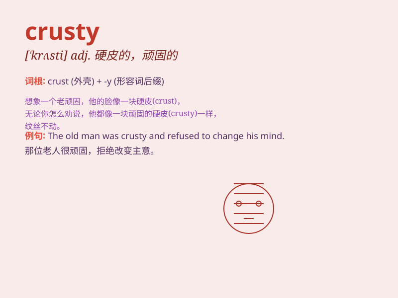

## crusty

**英音:** _[\'krʌstɪ]_ **美音:** _[\'krʌsti]_

**译义:** *adj.有硬壳的,顽固的,脾气暴躁的*

### 短语

+ **crusty bread:** _硬皮面包_

+ **crusty eyes:** _有眼屎的眼睛_

+ **crusty old man:** _脾气暴躁的老头_

+ **crusty surface:** _硬壳表面_

+ **crusty patch:** _硬皮斑块_

### 例句

#### 例句1

> **The bread had a crusty exterior and a soft interior.**

**中文翻译:** 面包有硬皮的外皮和柔软的内部。

**单词释义:** 硬脆的；有硬皮的

#### 例句2

> **He has a crusty personality and is not easy to get along
with.**

**中文翻译:** 他性格暴躁，不容易相处。

**单词释义:** 执拗的；脾气坏的

#### 例句3

> **The old man\'s face was crusty from years of working
outdoors.**

**中文翻译:** 由于常年在户外工作，老人的脸变得硬邦邦的。

**单词释义:** 粗糙的

### 背诵小故事

> A crusty old sailor was always alone on his ship. His rough and
crusty appearance scared others, but he was actually kind-hearted. One
day, he helped a lost kitten and showed his soft side.

**一位脾气暴躁的老水手总是独自在他的船上。他粗糙且暴躁的外表吓到了别人，但实际上他心地善良。有一天，他帮助了一只迷路的小猫，展现出了他温柔的一面。**

### 图义

