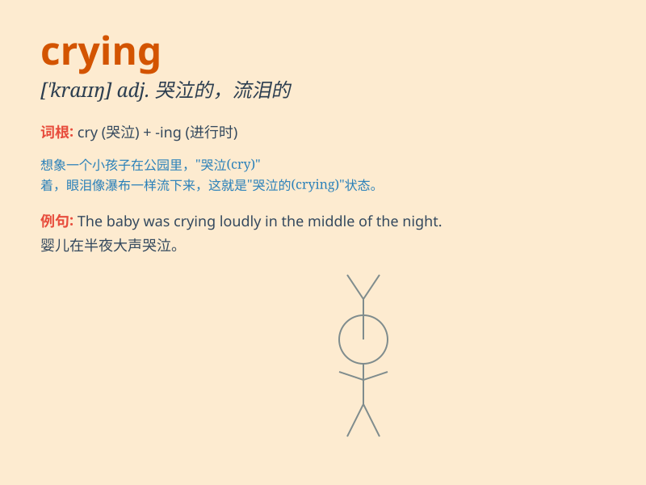

## crying

**英音:** _[\'kraɪɪŋ]_ **美音:** _[\'kraɪɪŋ]_

**译义:** *adj.叫喊的,显著的,嚎哭的*

### 短语

+ **crying shame:** _奇耻大辱；极为可耻的事_

+ **crying need:** _迫切的需要_

+ **crying evil:** _急需矫正的弊病_

+ **stop crying:** _停止哭泣_

+ **burst out crying:** _突然大哭_

### 例句

#### 例句1

> **The crying baby needed to be comforted.**

**中文翻译:** 哭闹的婴儿需要安抚。

**单词释义:** 哭闹的

#### 例句2

> **She was crying tears of joy when she received the good news.**

**中文翻译:** 当她收到这个好消息时，她流下了喜悦的泪水。

**单词释义:** 哭泣

#### 例句3

> **The sound of crying could be heard from the next room.**

**中文翻译:** 隔壁房间传来哭声。

**单词释义:** 哭泣

### 背诵小故事

> One day, I saw a little girl crying on the street. Her ice cream had
fallen to the ground. She was so sad. But then a kind man bought her a
new one and she stopped crying.

**有一天，我看到一个小女孩在街上哭。她的冰淇淋掉到了地上。她非常伤心。但后来一个善良的人给她买了一个新的，她就不哭了。**

### 图义

